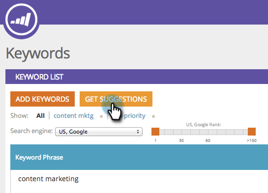

# SEO: obtenga las palabras clave sugeridas {#seo-get-suggested-keywords}

Marketo SEO puede sugerir las palabras clave que debe rastrear. Podemos ofrecer sugerencias basadas en una palabra clave o en la dirección URL de un sitio. ¡Pásame!

## Obtener sugerencias de palabras clave usando una palabra clave {#get-keyword-suggestions-using-a-keyword}

1. Vaya a la sección **Palabras clave**.

   

1. Haga clic en **Obtener sugerencias**.

   

1. Introduzca una **palabra clave**. Haga clic en **Sugerir palabras clave**.

   

   >[!TIP]
   >
   >¿Sabía que puede [agregar su palabra clave a una lista nueva o existente](/help/marketo/product-docs/additional-apps/seo/understanding-seo/seo-managing-lists.md) justo aquí?

1. Seleccione las palabras clave sugeridas. Haga clic en **Agregar seleccionado**.

   

   ¡bueno! Se ha añadido la palabra clave.

   

   ¡Sí! Ahora que sabe cómo obtener sugerencias de palabras clave basadas en una palabra clave, intente obtener sugerencias basadas en una dirección URL.

## Obtener sugerencias de palabras clave desde una dirección URL {#get-keyword-suggestions-from-a-url}

1. Vaya a la sección **Palabras clave**.

   

1. Haga clic en **Obtener sugerencias**.

   

1. Establezca **Sugerir por** en **URL**.

   

1. Introduzca una **URL** y haga clic en **Sugerir palabras clave**.

   

   >[!TIP]
   >
   >¿Sabía que puede [agregar su palabra clave a una lista nueva o existente](/help/marketo/product-docs/additional-apps/seo/understanding-seo/seo-managing-lists.md) justo aquí?

1. Seleccione las palabras clave sugeridas. Haga clic en **Agregar seleccionado**.

   

1. ¡bueno! Se ha añadido la palabra clave.

   

   Bien, estás bromeando con esto. ¡Sigue adelante!

   >[!MORELIKETHIS]
   >
   >* [Explicación de las palabras clave (vista de resumen)](/help/marketo/product-docs/additional-apps/seo/keywords/seo-understanding-keywords.md)
   >* [Agregar o eliminar palabras clave de una lista](/help/marketo/product-docs/additional-apps/seo/keywords/seo-add-remove-keywords-from-a-list.md)

