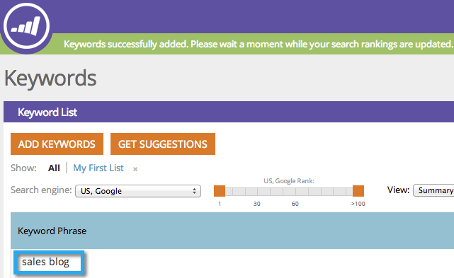

# SEO: Obtener palabras clave sugeridas {#seo-get-suggested-keywords}

El SEO de Marketo puede sugerir qué palabras clave debe rastrear. Podemos dar sugerencias basadas en una palabra clave o en la URL de un sitio. ¡Dale una oportunidad!

## Obtener sugerencias de palabras clave mediante una palabra clave {#get-keyword-suggestions-using-a-keyword}

1. Vaya a la **[!UICONTROL Palabras clave]** sección.

   

1. Clic **[!UICONTROL Obtener sugerencias]**.

   

1. Introduzca una **[!UICONTROL Palabra clave]**. Clic **[!UICONTROL Sugerir palabras clave]**.

   

   >[!TIP]
   >
   >¿Sabías que puedes  [añadir la palabra clave a una lista nueva o existente](/help/marketo/product-docs/additional-apps/seo/understanding-seo/seo-managing-lists.md) ¿aquí?

1. Seleccione las palabras clave sugeridas. Clic **[!UICONTROL Agregar selección]**.

   

   ¡Excelente! Se ha añadido su palabra clave.

   

   ¡Yeehaw! Ahora que sabe cómo obtener sugerencias de palabras clave basadas en una palabra clave, intente obtener sugerencias basadas en una dirección URL.

## Obtener sugerencias de palabras clave de una dirección URL  {#get-keyword-suggestions-from-a-url}

1. Vaya a la **[!UICONTROL Palabras clave]** sección.

   

1. Clic **[!UICONTROL Obtener sugerencias]**.

   

1. Establecer **[!UICONTROL Sugerir por]** hasta **[!UICONTROL URL]**.

   

1. Introduzca una **[!UICONTROL URL]** y haga clic en **[!UICONTROL Sugerir palabras clave]**.

   

   >[!TIP]
   >
   >¿Sabías que puedes [añadir la palabra clave a una lista nueva o existente](/help/marketo/product-docs/additional-apps/seo/understanding-seo/seo-managing-lists.md) ¿aquí?

1. Seleccione las palabras clave sugeridas. Clic **[!UICONTROL Agregar selección]**.

   

¡Excelente! Se ha añadido su palabra clave.

>[!MORELIKETHIS]
>
>* [Explicación de las palabras clave (vista de resumen)](/help/marketo/product-docs/additional-apps/seo/keywords/seo-understanding-keywords.md)
>* [Agregar o quitar palabras clave de una lista](/help/marketo/product-docs/additional-apps/seo/keywords/seo-add-remove-keywords-from-a-list.md)

