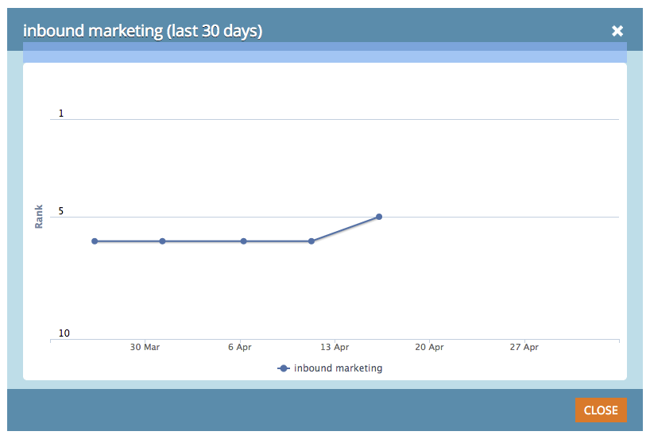

# SEO: gráfico de tendencias de palabras clave {#seo-keyword-trends-chart}

Es importante supervisar la tendencia de las [Clasificaciones SERP](/help/marketo/product-docs/additional-apps/seo/understanding-seo/understanding-search-engine-optimization.md) de palabras clave a lo largo del tiempo. Consulte este gráfico interesante para monitorizar el progreso.

>[!IMPORTANT]
>
>El 31 de marzo de 2026, Marketo Engage dejará de utilizar la función Optimización del motor de búsqueda. Exporte los datos pertinentes el 30 de marzo o antes. [Más información](https://nation.marketo.com/t5/product-blogs/marketo-engage-seo-feature-deprecation/ba-p/359060){target="_blank"}.
>
>* [Problemas de exportación](https://experienceleague.adobe.com/en/docs/marketo/using/product-docs/additional-apps/seo/pages/seo-export-issues-to-csv){target="_blank"}
>* [Exportar resultados de palabras clave](https://experienceleague.adobe.com/en/docs/marketo/using/product-docs/additional-apps/seo/keywords/seo-exporting-keyword-results){target="_blank"}
>* [Exportar tendencias de palabras clave](https://experienceleague.adobe.com/en/docs/marketo/using/product-docs/additional-apps/seo/reports/seo-use-the-keyword-trends-report#exporting-data){target="_blank"}
>* [Exportar tendencias de palabras clave de la competencia](https://experienceleague.adobe.com/en/docs/marketo/using/product-docs/additional-apps/seo/reports/seo-use-the-competitor-kw-trends-report#exporting-data){target="_blank"}

1. Vaya a la sección **[!UICONTROL Palabras clave]**.

   

1. Haga clic en el cuadro de clasificación de la palabra clave de tendencia que desee aplicar.

   

   Muestra tu [rango SERP](/help/marketo/product-docs/additional-apps/seo/understanding-seo/understanding-search-engine-optimization.md) durante los últimos 30 días:

   

   >[!TIP]
   >
   >Puede obtener más información sobre la clasificación de palabras clave en el Informe de tendencias de palabras clave.

   >[!MORELIKETHIS]
   >
   >[Uso del informe de tendencias de palabras clave](/help/marketo/product-docs/additional-apps/seo/reports/seo-use-the-keyword-trends-report.md)
