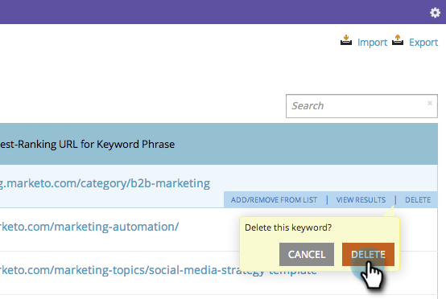

# SEO - Eliminar una palabra clave {#seo-remove-a-keyword}

Si tiene una palabra clave para la que no desea seguir optimizándola, así es como eliminarla.

1. Haga clic en para ir a la **Palabras clave** para obtener más información.

   

1. Pase el ratón sobre la palabra clave que desee eliminar y haga clic en **DELETE**.

   

1. Haga clic en **Eliminar** para confirmar.

   

   ¡Qué alivio! Ahora puedes pasar a cosas más grandes y mejores.
