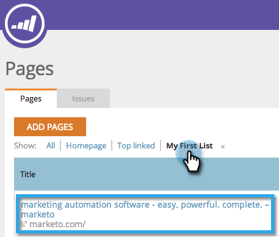
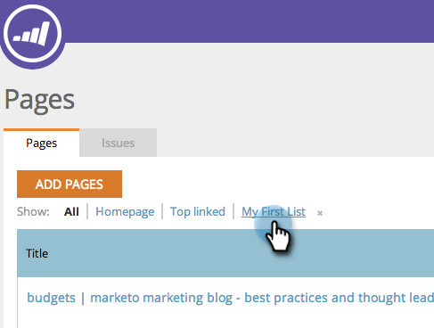

# SEO: Agregar o eliminar página de la lista {#seo-add-remove-page-from-list}

¿Desea administrar sus páginas? Puede hacerlo fácilmente creando una lista. Puede utilizar listas para organizar páginas o filtrar datos en tableros.

## Agregar página a una lista {#add-page-to-a-list}

1. Vaya a la sección **Páginas**.

   

1. Pase el ratón sobre la página que quiera añadir a una lista. Haga clic en **Agregar o quitar de la lista**.

   

1. Haga clic en la lista a la que desee agregar la página.

   

   >[!TIP]
   >
   >También puede crear una nueva lista para que la página vaya. Escriba el nombre que desee en Crear una lista nueva.

1. Haga clic en la lista a la que acaba de agregar su página.

   

¡Sí! Ahora debería ver la página agregada a la lista.

## Eliminar página de una lista {#remove-page-from-a-list}

1. Vaya a la sección Páginas .

   

1. En la ficha Páginas, haga clic en la lista que desee limpiar.

   

1. Pase el ratón sobre la página que desee eliminar. Haga clic en **Agregar o quitar de la lista**.

   

1. Haga clic en la lista de la que desea eliminarla.

   >[!NOTE]
   >
   >Todas las listas a las que pertenece la palabra clave actualmente tendrán una marca de verificación. Una vez eliminada de la lista, la comprobación desaparece.

   

Listo. La página se elimina de la lista.
