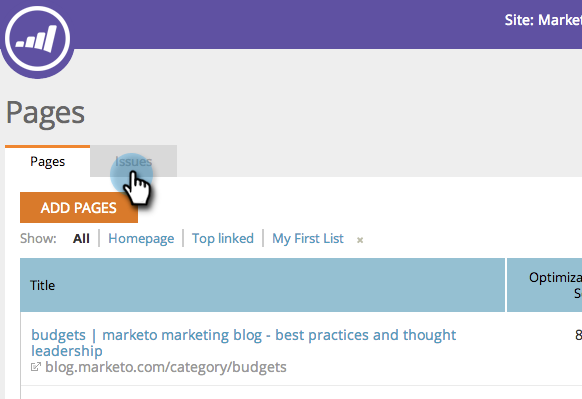
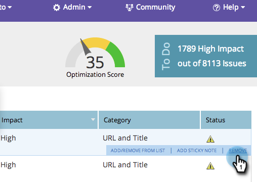
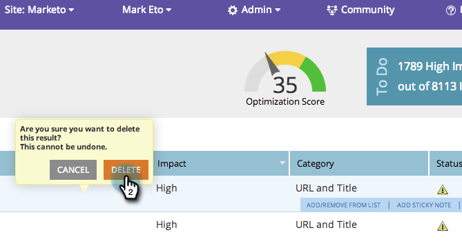

# SEO: quitar/eliminar un problema de página {#seo-remove-delete-a-page-issue}

Puede que no todos los problemas de la página le sean útiles. A continuación se indica cómo eliminar uno.

>[!IMPORTANT]
>
>El 31 de marzo de 2026, Marketo Engage dejará de utilizar la función Optimización del motor de búsqueda. Exporte los datos pertinentes el 30 de marzo o antes. [Más información](https://nation.marketo.com/t5/product-blogs/marketo-engage-seo-feature-deprecation/ba-p/359060){target="_blank"}.
>
>* [Problemas de exportación](https://experienceleague.adobe.com/es/docs/marketo/using/product-docs/additional-apps/seo/pages/seo-export-issues-to-csv){target="_blank"}
>* [Exportar resultados de palabras clave](https://experienceleague.adobe.com/es/docs/marketo/using/product-docs/additional-apps/seo/keywords/seo-exporting-keyword-results){target="_blank"}
>* [Exportar tendencias de palabras clave](https://experienceleague.adobe.com/es/docs/marketo/using/product-docs/additional-apps/seo/reports/seo-use-the-keyword-trends-report#exporting-data){target="_blank"}
>* [Exportar tendencias de palabras clave de la competencia](https://experienceleague.adobe.com/es/docs/marketo/using/product-docs/additional-apps/seo/reports/seo-use-the-competitor-kw-trends-report#exporting-data){target="_blank"}

1. Vaya a la sección **[!UICONTROL Páginas]**.

   

1. En la sección [!UICONTROL Páginas], haga clic en **[!UICONTROL Problemas]**.

   

1. Pase el ratón sobre el problema de página que quiera eliminar. Haga clic en **[!UICONTROL Quitar]**.

   

1. Si hace clic en **[!UICONTROL Eliminar]**, se eliminará permanentemente este problema de página.

   >[!CAUTION]
   >
   >No puede deshacer esta acción. Una vez que se elimine un problema, puede volver a generarlos si elimina la página y la vuelve a agregar en.

   

Se ha eliminado su problema de página.
