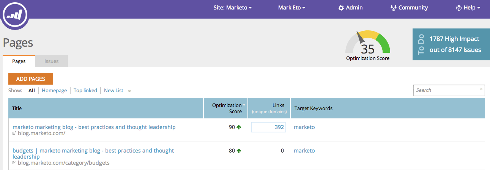

# SEO: Explicación de las páginas {#seo-understanding-pages}

## Puntuación de optimización de página / Utilidad &quot;To Do&quot; {#page-optimization-score-to-do-widget}

La puntuación de optimización de la página es una clasificación general de la optimización de la página para la búsqueda, en una escala del 1 al 100. Se basa en decenas de prácticas recomendadas en SEO.

* 0 - 35 = No está bien optimizado
* 35 - 70 = En el camino correcto
* 70 - 100 = ¡Hacer bueno!

>[!TIP]
>
>Haga clic en el vínculo Impacto alto del cuadro Para hacer, lo redirigirá a la pestaña Problemas y mostrará los problemas de alta prioridad que debe resolver.

## Ficha Páginas {#pages-tab}

La ficha Páginas muestra la optimización de las páginas individuales del sitio para la búsqueda.

| Nombre de columna | Descripción |
|---|---|
| Título | Título y dirección URL de todas las páginas de su dominio. Compruebe su dominio. |
| Puntuación de optimización | La salsa secreta utilizada para mostrarle la optimización de su página para la búsqueda en una escala de 1 a 100. |
| Vínculos | Número de dominios diferentes con al menos 1 vínculo entrante al sitio. |
| Palabras clave de Target | Las palabras clave para las que decide optimizar cada página. [Esto requiere la entrada de](/help/marketo/product-docs/additional-apps/seo/pages/seo-using-the-page-detail-drill-down.md). |

## Ficha Problemas {#issues-tab}

La pestaña Problemas identificará las mejoras que puede realizar para aumentar la puntuación y la clasificación de la optimización.

| Nombre de columna | Descripción |
|---|---|
| Problemas | Lista de elementos procesables que ayudarán a mejorar la puntuación de optimización. |
| Impacto | Cuán crítico es para su puntuación general. ¡Arregle primero los elementos de alto impacto! |
| Categoría | Tipo de problema del que se informa. |
| Estado | ¿La tarea está completa o aún abierta? Una vez que usted y el administrador web corrijan el problema en su sitio, el estado debe cambiar a resuelto (comprobación verde). |

Increíble, ahora que conoce los conceptos básicos de las páginas, consulte la [Artículo Detalles de página Desglose](/help/marketo/product-docs/additional-apps/seo/pages/seo-using-the-page-detail-drill-down.md) para aprender cosas más geniales que puedes hacer.
