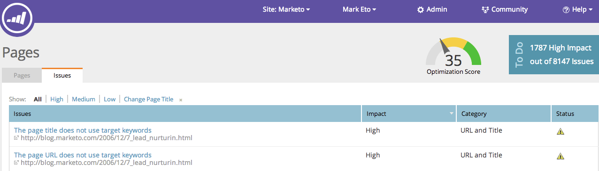

# SEO: explicación de las páginas {#seo-understanding-pages}

## Puntuación de optimización de la página / Widget de tareas pendientes {#page-optimization-score-to-do-widget}

La puntuación de optimización de la página [!UICONTROL 1&rbrace; es una clasificación general de la optimización de la página para la búsqueda, en una escala del 1 al 100. &#x200B;] Se basa en docenas de prácticas recomendadas en SEO.

* 0 - 35 = No está bien optimizado
* 35 - 70 = En el camino correcto
* 70 - 100 = ¡Excelente!

>[!IMPORTANT]
>
>El 31 de marzo de 2026, Marketo Engage dejará de utilizar la función Optimización del motor de búsqueda. Exporte los datos pertinentes el 30 de marzo o antes. [Más información](https://nation.marketo.com/t5/product-blogs/marketo-engage-seo-feature-deprecation/ba-p/359060){target="_blank"}.
>
>* [Problemas de exportación](https://experienceleague.adobe.com/en/docs/marketo/using/product-docs/additional-apps/seo/pages/seo-export-issues-to-csv){target="_blank"}
>* [Exportar resultados de palabras clave](https://experienceleague.adobe.com/en/docs/marketo/using/product-docs/additional-apps/seo/keywords/seo-exporting-keyword-results){target="_blank"}
>* [Exportar tendencias de palabras clave](https://experienceleague.adobe.com/en/docs/marketo/using/product-docs/additional-apps/seo/reports/seo-use-the-keyword-trends-report#exporting-data){target="_blank"}
>* [Exportar tendencias de palabras clave de la competencia](https://experienceleague.adobe.com/en/docs/marketo/using/product-docs/additional-apps/seo/reports/seo-use-the-competitor-kw-trends-report#exporting-data){target="_blank"}

## Ficha [!UICONTROL Páginas] {#pages-tab}

La ficha **[!UICONTROL Páginas]** le muestra la optimización de las páginas individuales del sitio para la búsqueda.

| Nombre de columna | Descripción |
|---|---|
| [!UICONTROL Título] | Título y dirección URL de todas las páginas del dominio. Compruebe su dominio. |
| [!UICONTROL Puntuación de optimización] | La salsa secreta utilizada para mostrarle lo bien que su página está optimizada para la búsqueda en una escala de 1 a 100. |
| [!UICONTROL Vínculos] | Número de dominios diferentes con al menos 1 vínculo de entrada al sitio. |
| [!UICONTROL Palabras clave de destino] | Las palabras clave para las que decida optimizar cada página. [Esto requiere su entrada](/help/marketo/product-docs/additional-apps/seo/pages/seo-using-the-page-detail-drill-down.md). |

## Ficha [!UICONTROL Problemas] {#issues-tab}

La ficha **[!UICONTROL Problemas]** identificará qué mejoras puede realizar para aumentar la puntuación y la clasificación de la optimización.

| Nombre de columna | Descripción |
|---|---|
| [!UICONTROL Problemas] | Lista de elementos procesables que le ayudarán a mejorar su puntuación de optimización. |
| [!UICONTROL Impacto] | Lo crítico que es para su puntuación general. ¡Corrija primero los elementos de alto impacto! |
| [!UICONTROL Categoría] | El tipo de problema del que se informa. |
| [!UICONTROL Estado] | ¿La tarea está completa o sigue abierta? Una vez que usted y el administrador del sitio hayan corregido el problema en el sitio, el estado debería cambiar a resuelto (marca verde). |

Impresionante, ahora que conoces los conceptos básicos de las páginas, revisa el [artículo Detalles de la página](/help/marketo/product-docs/additional-apps/seo/pages/seo-using-the-page-detail-drill-down.md) para obtener más información sobre las cosas interesantes que puedes hacer.
