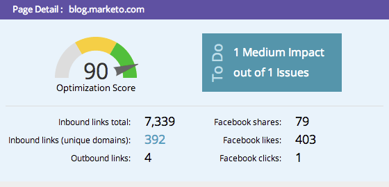

# SEO - Uso del desglose de detalles de página {#seo-using-the-page-detail-drill-down}

Puede ver mucha información sobre las páginas mediante el desglose detallado de la página.

## Buscar desglose de página {#find-page-drill-down}

1. Vaya a la sección Páginas.

   

1. Haga clic en la página para la que desee ver los detalles.

   

   He aquí, ¡el detalle de la página se desglosa!

   

## Sección de detalles de página {#page-detail-section}

| Elemento | Descripción |
|---|---|
| Puntuación de optimización | La salsa secreta que se utiliza para mostrar la eficacia de la optimización de la página para la búsqueda en una escala de 1 a 100. |
| Cuadro de tareas pendientes | Muestra el número de problemas abiertos relacionados con la página en la que se encuentra. |
| Vínculos de entrada totales | El número total de vínculos de entrada al sitio web. |
| Vínculos de entrada (dominios únicos) | El número de otros sitios web con al menos un vínculo de entrada al sitio. |
| Vínculos de salida | El número de vínculos que salen a otros sitios web desde esta página en particular. |
| Compartidos en Facebook | Número de veces que esta página se compartió en Facebook. |
| Cantidad de &quot;Me gusta&quot; de Facebook | Número de veces que se ha dado &quot;Me gusta&quot; a este recurso compartido de página en Facebook. |
| Clics en Facebook | Número de clics del recurso compartido de Facebook. |

## Palabras clave para las que la página está optimizada {#keyword-s-that-page-is-optimized-for}

Aquí es donde [selecciona la palabra clave que intenta optimizar la página para](/help/marketo/product-docs/additional-apps/seo/keywords/seo-optimize-specific-pages-with-targeted-keywords.md).

>[!NOTE]
>
>Este es un paso importante para aprovechar al máximo esta función. Le recomendamos que utilice menos de tres palabras clave por página. Idealmente sólo uno.

## Resultados de optimización de página {#page-optimization-results}

Los resultados de optimización de página le indicarán los pasos exactos que debe seguir para aumentar la puntuación de optimización o mejorar el rendimiento en la búsqueda de esta página.

Bastante dulce, ¿verdad? Obtenga más información sobre las páginas aquí.

>[!MORELIKETHIS]
>
>[Optimizar páginas específicas con palabras clave de objetivo](/help/marketo/product-docs/additional-apps/seo/keywords/seo-optimize-specific-pages-with-targeted-keywords.md)
