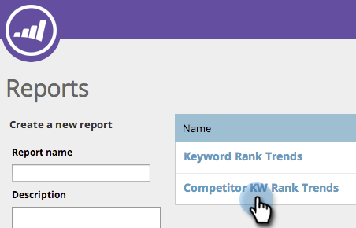

# SEO: usar el informe de tendencias de KW de la competencia {#seo-use-the-competitor-kw-trends-report}

En este informe, puede ver cómo se clasifican usted y sus competidores en términos de palabras clave a lo largo del tiempo.

## Buscar informes {#find-reports}

1. Vaya a **Reports**.

   

1. Haga clic en **Tendencias de clasificación KW competitiva**.

   

## Gráfico de tendencias de clasificación KW {#kw-rank-trends-graph}

Este gráfico puede mostrar qué porcentaje de palabras clave se clasifican en un rango especificado y cómo se apilan sus competidores.

| Elemento | Descripción |
|---|---|
| Palabras clave | El número de palabras clave que está rastreando. |
| Direcciones URL de clasificación | El número de direcciones URL del sitio que clasifican en el intervalo que ha establecido. |
| % en rango | El porcentaje de palabras clave de la clasificación en el rango que ha establecido. |
| Promedio de búsquedas | El número promedio de búsquedas de esas palabras clave que se produjeron durante el intervalo establecido (en los últimos 30 días, en la búsqueda de Google US) |

## Filtrado de datos {#filtering-data}

1. Haga clic en la lista desplegable y seleccione el período de tiempo que desee.

   

1. Haga clic en la lista desplegable **Rango** para elegir para qué rango desea ver las palabras clave.

   

## Exportación de datos {#exporting-data}

>[!TIP]
>
>Puede exportar este informe a su escritorio.

1. Haga clic en **Exportar CSV** o **Export PDF**.

   

   ¡Trabajo de A+!
