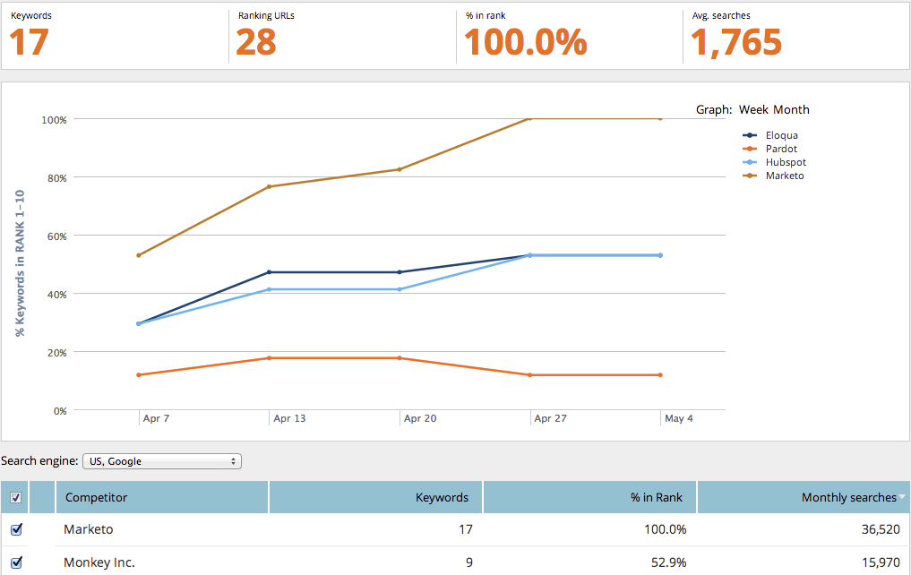
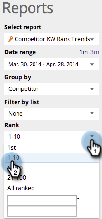

# SEO: utilizar el informe Tendencias de KW de la competencia {#seo-use-the-competitor-kw-trends-report}

En este informe, puede ver cómo usted y sus competidores se clasifican según las palabras clave a lo largo del tiempo.

>[!IMPORTANT]
>
>El 31 de marzo de 2026, Marketo Engage [dejó de utilizar la característica Optimización del motor de búsqueda](https://nation.marketo.com/t5/product-blogs/marketo-engage-seo-feature-deprecation/ba-p/359060){target="_blank"}. [seo.marketo.com](https://seo.marketo.com/) todavía está disponible por tiempo limitado. Siga los pasos de los artículos siguientes para exportar cualquier dato.
>
>* [Problemas de exportación](https://experienceleague.adobe.com/en/docs/marketo/using/product-docs/additional-apps/seo/pages/seo-export-issues-to-csv){target="_blank"}
>* [Exportar resultados de palabras clave](https://experienceleague.adobe.com/en/docs/marketo/using/product-docs/additional-apps/seo/keywords/seo-exporting-keyword-results){target="_blank"}
>* [Exportar tendencias de palabras clave](https://experienceleague.adobe.com/en/docs/marketo/using/product-docs/additional-apps/seo/reports/seo-use-the-keyword-trends-report#exporting-data){target="_blank"}
>* [Exportar tendencias de palabras clave de la competencia](https://experienceleague.adobe.com/en/docs/marketo/using/product-docs/additional-apps/seo/reports/seo-use-the-competitor-kw-trends-report#exporting-data){target="_blank"}

## Buscar informes {#find-reports}

1. Ir a **[!UICONTROL Informes]**.

   

1. Haga clic en **[!UICONTROL Tendencias de clasificación KW de la competencia]**.

   

## Gráfico de tendencias de clasificación KW {#kw-rank-trends-graph}

Este gráfico puede mostrarle qué porcentaje de sus palabras clave se clasifican en un rango especificado y cómo se apilan sus competidores.

| Elemento | Descripción |
|---|---|
| [!UICONTROL Palabras clave] | El número de palabras clave que está rastreando. |
| [!UICONTROL URL de clasificación] | El número de direcciones URL en la clasificación del sitio en el rango que ha establecido. |
| [!UICONTROL % en el rango] | El porcentaje de clasificación de palabras clave en el rango que ha establecido. |
| [!UICONTROL Promedio búsquedas] | El número promedio de búsquedas en esas palabras clave que se produjeron durante el intervalo establecido (en los últimos 30 días, en la búsqueda de Google US) |

## Filtrado de datos {#filtering-data}

1. Haga clic en la lista desplegable y seleccione el periodo de tiempo deseado.

   

1. Haga clic en el menú desplegable **[!UICONTROL Clasificación]** para elegir el rango de clasificación para el que desea ver las palabras clave.

   

## Exportando datos {#exporting-data}

1. Haga clic en **[!UICONTROL Exportar CSV]** o en **[!UICONTROL Export PDF]**.

   
