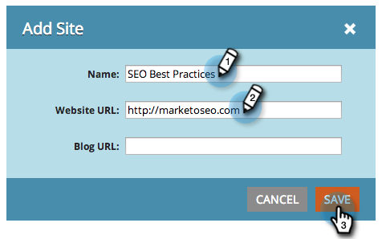

# SEO: Agregar un sitio/eliminar un sitio {#seo-add-a-site-delete-a-site}

Para que Marketo extraiga datos (vínculos de entrada y recomendaciones) relevantes para las páginas de su sitio, debe definir la dirección URL del sitio aquí.

>[!AVAILABILITY]
>
>No todos los clientes han adquirido esta funcionalidad. Póngase en contacto con su representante de ventas para obtener más información.

## Agregar un sitio {#add-a-site}

1. Haga clic en la lista desplegable Administración y seleccione **Administración**.

   >[!NOTE]
   >
   >**Se requieren permisos de administrador**

   

1. Haga clic en **Agregar sitio**.

   

1. Introduzca el **Name, Website URL** y haga clic en **Save**.

   >[!TIP]
   >
   >También puede agregar una **URL del blog** si tiene una.

   

   ¡bueno! Acaba de agregar otro sitio.

   

## Eliminar un sitio {#delete-a-site}

Si realiza el seguimiento de más de un sitio, también puede eliminar un sitio que ya no esté interesado en optimizar.

1. Haga clic en la lista desplegable Administración y seleccione **Administración**.

   

1. Haga clic en el sitio que desee eliminar.

   

1. Haga clic en **Eliminar**.

   

1. Confirme que desea **Eliminar**.

   

   >[!NOTE]
   >
   >Solo puede eliminar un sitio si tiene más de uno. Si solo tiene uno, puede realizar un restablecimiento seleccionando el sitio y haciendo clic en **Restaurar**. Al restablecer un sitio _se eliminarán todos los datos del sitio_ y se recreará el sitio.
