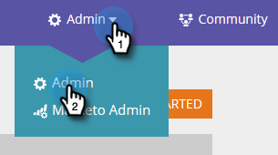
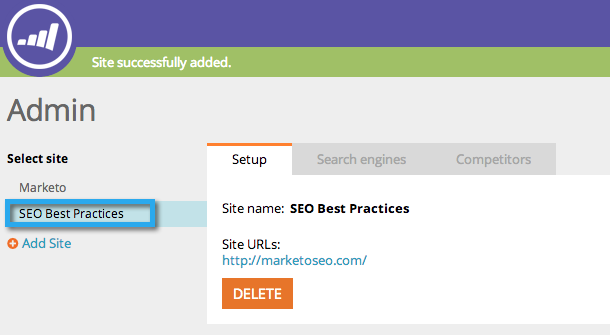
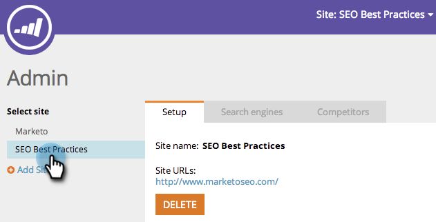
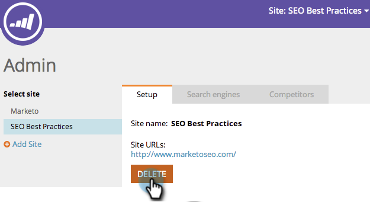
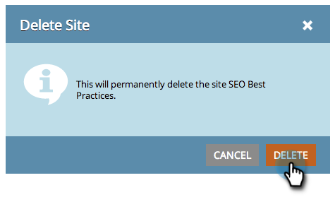

# SEO: añadir/eliminar un sitio {#seo-add-a-site-delete-a-site}

Para que Marketo extraiga datos (vínculos de entrada y recomendaciones) relevantes para las páginas del sitio, debe definir la dirección URL del sitio aquí.

>[!IMPORTANT]
>
>El 31 de marzo de 2026, Marketo Engage dejará de utilizar la función Optimización del motor de búsqueda. Exporte los datos pertinentes el 30 de marzo o antes. [Más información](https://nation.marketo.com/t5/product-blogs/marketo-engage-seo-feature-deprecation/ba-p/359060){target="_blank"}.
>
>* [Problemas de exportación](https://experienceleague.adobe.com/es/docs/marketo/using/product-docs/additional-apps/seo/pages/seo-export-issues-to-csv){target="_blank"}
>* [Exportar resultados de palabras clave](https://experienceleague.adobe.com/es/docs/marketo/using/product-docs/additional-apps/seo/keywords/seo-exporting-keyword-results){target="_blank"}
>* [Exportar tendencias de palabras clave](https://experienceleague.adobe.com/es/docs/marketo/using/product-docs/additional-apps/seo/reports/seo-use-the-keyword-trends-report#exporting-data){target="_blank"}
>* [Exportar tendencias de palabras clave de la competencia](https://experienceleague.adobe.com/es/docs/marketo/using/product-docs/additional-apps/seo/reports/seo-use-the-competitor-kw-trends-report#exporting-data){target="_blank"}

## [!UICONTROL Agregar un sitio] {#add-a-site}

1. Haga clic en el menú desplegable Administración y seleccione **[!UICONTROL Administrador]**.

   >[!NOTE]
   >
   >**Se requieren permisos de administrador**

   

1. Haga clic en **[!UICONTROL Agregar sitio]**.

   

1. Escriba **[!UICONTROL Name], [!UICONTROL URL del sitio web]** y haga clic en **[!UICONTROL Guardar]**.

   >[!TIP]
   >
   >También puede agregar una **[!UICONTROL URL del blog]** si la tiene.

   

   ¡Excelente! Acaba de agregar otro sitio.

   

## Eliminar un sitio {#delete-a-site}

Si realiza el seguimiento de más de un sitio, también puede eliminar un sitio que ya no le interese optimizar.

1. Haga clic en el menú desplegable Administración y seleccione **[!UICONTROL Administrador]**.

   

1. Haga clic en el sitio que desee eliminar.

   

1. Haga clic en **[!UICONTROL Eliminar]**.

   

1. Confirme que quiere **[!UICONTROL eliminar]**.

   

   >[!NOTE]
   >
   >Solo puede eliminar un sitio si tiene más de uno. Si solo tiene uno, puede restablecer seleccionando el sitio y haciendo clic en **[!UICONTROL Restablecer]**. Si se restablece un sitio, _se eliminarán todos los datos del sitio_ y se volverá a crear el sitio.
