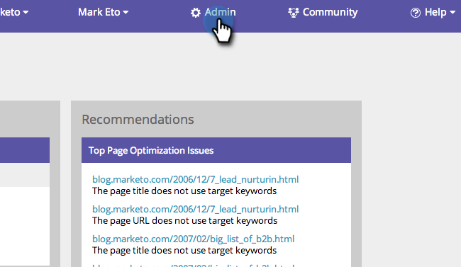
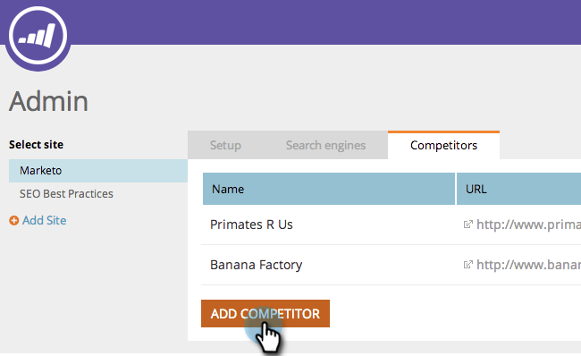
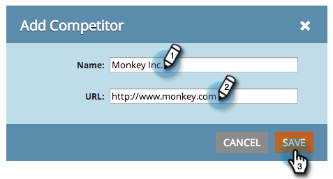

# SEO: añadir competidores {#seo-add-competitors}

Añadir competidores le permitirá rastrear el rendimiento que tienen para las mismas palabras clave y vínculos de entrada que elija monitorizar.

>[!IMPORTANT]
>
>El 31 de marzo de 2026, Marketo Engage dejará de utilizar la función Optimización del motor de búsqueda. Exporte los datos pertinentes el 30 de marzo o antes. [Más información](https://nation.marketo.com/t5/product-blogs/marketo-engage-seo-feature-deprecation/ba-p/359060){target="_blank"}.
>
>* [Problemas de exportación](https://experienceleague.adobe.com/es/docs/marketo/using/product-docs/additional-apps/seo/pages/seo-export-issues-to-csv){target="_blank"}
>* [Exportar resultados de palabras clave](https://experienceleague.adobe.com/es/docs/marketo/using/product-docs/additional-apps/seo/keywords/seo-exporting-keyword-results){target="_blank"}
>* [Exportar tendencias de palabras clave](https://experienceleague.adobe.com/es/docs/marketo/using/product-docs/additional-apps/seo/reports/seo-use-the-keyword-trends-report#exporting-data){target="_blank"}
>* [Exportar tendencias de palabras clave de la competencia](https://experienceleague.adobe.com/es/docs/marketo/using/product-docs/additional-apps/seo/reports/seo-use-the-competitor-kw-trends-report#exporting-data){target="_blank"}

1. Vaya al área de **[!UICONTROL Admin]**.

   

1. Haga clic en la ficha **[!UICONTROL Competidores]**.

   

1. Haga clic en **[!UICONTROL Agregar competidor]**.

   

1. Escriba **[!UICONTROL Name]** y **[!UICONTROL URL]** de su competidor.

   

   Ahora debería ver a su competidor en la lista.

   

   >[!MORELIKETHIS]
   >
   >* [Agregar palabras clave](/help/marketo/product-docs/additional-apps/seo/keywords/seo-add-keywords.md){target="_blank"}
   >* [Explicación de las palabras clave (vista de competidor)](/help/marketo/product-docs/additional-apps/seo/keywords/seo-understanding-keywords.md){target="_blank"}
