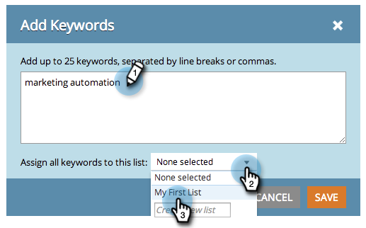

# SEO - Administración de listas {#seo-managing-lists}

Puede agregar cosas a listas cuando agregue palabras clave, páginas, problemas de página o vínculos entrantes. Las listas le ayudan a mantenerse organizadas y permiten filtrar informes para ver solo los datos de esa lista. Así es como se hacen:

1. Haga clic en **Agregar palabras clave**.

   >[!NOTE]
   >
   >Esto funciona del mismo modo cuando se añaden páginas, problemas de páginas y vínculos entrantes.

   

1. Introduzca la palabra clave. Seleccione una lista a la que añadirla en la lista desplegable.

   

   >[!TIP]
   >
   >Puede crear una nueva lista en la lista desplegable . Introduzca un título y pulse la tecla de retorno.

1. Haga clic en **Guardar**.

   

   ¡Feliz organización!
