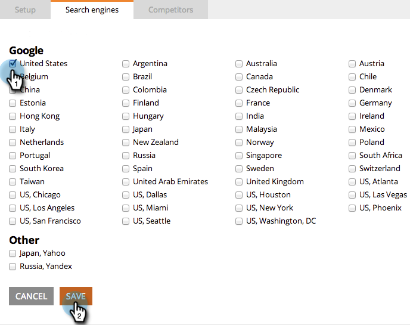

# SEO: elija la región o el país para el motor de búsqueda {#seo-pick-region-country-for-your-search-engine}

Los administradores de SEO podrán elegir la región del motor de búsqueda al que desean obtener la información de clasificación de palabras clave.

>[!NOTE]
>
>**Se requieren permisos de administrador**

1. Vaya a la sección **Admin**.

1. Haga clic en la pestaña **Motores de búsqueda**.

   

1. Elija para qué país/ciudad desea optimizar y haga clic en **Guardar**.

>[!NOTE]
>
>De forma predeterminada, puede utilizar un país para un motor de búsqueda. Si necesita más información, póngase en contacto con su representante de ventas.

Excelente trabajo. Ahora verá clasificaciones de palabras clave para el país o la ciudad que elija.

>[!MORELIKETHIS]
>
>* [Explicación del panel: Instantánea de SEO](/help/marketo/product-docs/additional-apps/seo/understanding-seo/understanding-the-seo-dashboard-seo-snapshot.md)
>* [Explicación del panel: SEO Recommendations](/help/marketo/product-docs/additional-apps/seo/understanding-seo/understanding-the-seo-dashboard-seo-recommendations.md)

