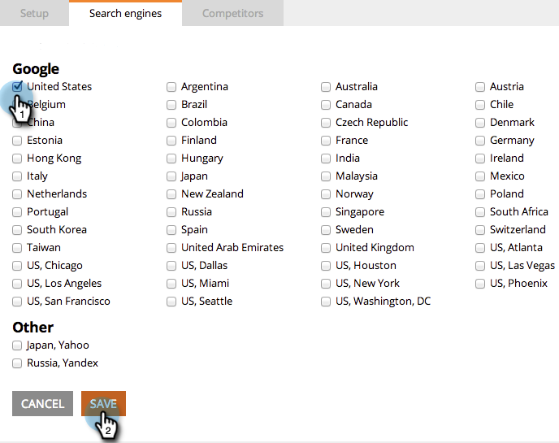

# SEO: elegir región/país para su motor de búsqueda {#seo-pick-region-country-for-your-search-engine}

Los administradores de SEO podrán elegir la región del motor de búsqueda que desee para obtener información de clasificación de palabras clave.

>[!IMPORTANT]
>
>El 31 de marzo de 2026, Marketo Engage dejará de utilizar la función Optimización del motor de búsqueda. Exporte los datos pertinentes el 30 de marzo o antes. [Más información](https://nation.marketo.com/t5/product-blogs/marketo-engage-seo-feature-deprecation/ba-p/359060){target="_blank"}.
>
>* [Problemas de exportación](https://experienceleague.adobe.com/en/docs/marketo/using/product-docs/additional-apps/seo/pages/seo-export-issues-to-csv){target="_blank"}
>* [Exportar resultados de palabras clave](https://experienceleague.adobe.com/en/docs/marketo/using/product-docs/additional-apps/seo/keywords/seo-exporting-keyword-results){target="_blank"}
>* [Exportar tendencias de palabras clave](https://experienceleague.adobe.com/en/docs/marketo/using/product-docs/additional-apps/seo/reports/seo-use-the-keyword-trends-report#exporting-data){target="_blank"}
>* [Exportar tendencias de palabras clave de la competencia](https://experienceleague.adobe.com/en/docs/marketo/using/product-docs/additional-apps/seo/reports/seo-use-the-competitor-kw-trends-report#exporting-data){target="_blank"}

>[!NOTE]
>
>**Se requieren permisos de administrador**

1. Vaya a la sección **[!UICONTROL Admin]**.

1. Haga clic en la ficha **[!UICONTROL Motores de búsqueda]**.

   

1. Elija para qué país o ciudad desea optimizar y haga clic en **[!UICONTROL Guardar]**.

>[!NOTE]
>
>De forma predeterminada, puede utilizar un país para un motor de búsqueda. Si necesita más, póngase en contacto con su representante de ventas.

Ahora, consulte las clasificaciones de palabras clave del país o la ciudad que elija.

>[!MORELIKETHIS]
>
>* [Explicación del panel: instantánea de SEO](/help/marketo/product-docs/additional-apps/seo/understanding-seo/understanding-the-seo-dashboard-seo-snapshot.md){target="_blank"}
>* [Explicación del panel: Recomendaciones de SEO](/help/marketo/product-docs/additional-apps/seo/understanding-seo/understanding-the-seo-dashboard-seo-recommendations.md){target="_blank"}
