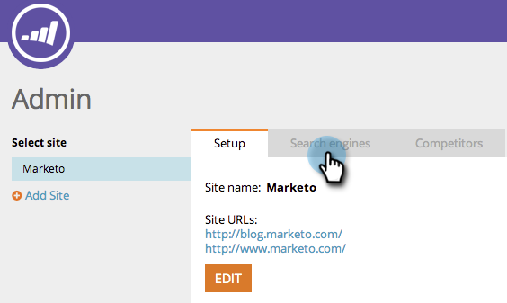

# SEO: Elija la región o el país del motor de búsqueda {#seo-pick-region-country-for-your-search-engine}

Los administradores de SEO podrán elegir la región para el motor de búsqueda que desee para obtener la información de clasificación de palabras clave.

>[!NOTE]
>
>**Se requieren permisos de administración**

1. Vaya a la sección **Administración**.

1. Haga clic en la ficha **Motores de búsqueda**.

   

1. Elija para qué país o ciudad desea optimizar y haga clic en **Guardar**.

>[!NOTE]
>
>De manera predeterminada, puede utilizar un país para un motor de búsqueda. Si necesita más información, póngase en contacto con su representante de ventas.

Excelente trabajo. Ahora verá las clasificaciones de palabras clave para el país o la ciudad que elija.

>[!MORELIKETHIS]
>
>* [Comprensión del Panel: Instantánea de SEO](/help/marketo/product-docs/additional-apps/seo/understanding-seo/understanding-the-seo-dashboard-seo-snapshot.md)
>* [Comprensión del Panel: SEO Recommendations](/help/marketo/product-docs/additional-apps/seo/understanding-seo/understanding-the-seo-dashboard-seo-recommendations.md)

