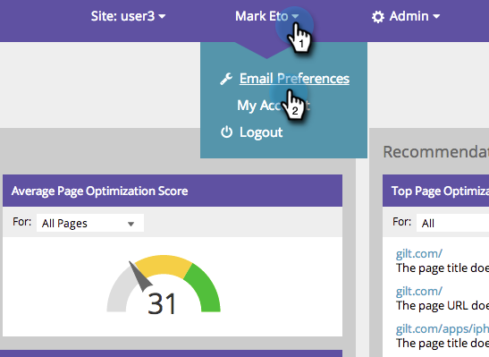

# SEO: Establezca sus preferencias de alerta de correo electrónico {#seo-set-your-email-alert-preferences}

Puede personalizar sus preferencias de correo electrónico para determinar cuándo se le actualizará cuando realice los esfuerzos de SEO.

1. En la barra de navegación superior, haga clic en su nombre de usuario. Haga clic en **Preferencias de correo electrónico**.

   

1. Indique lo que desea que se le alerte por correo electrónico y haga clic en **Guardar**.

   
