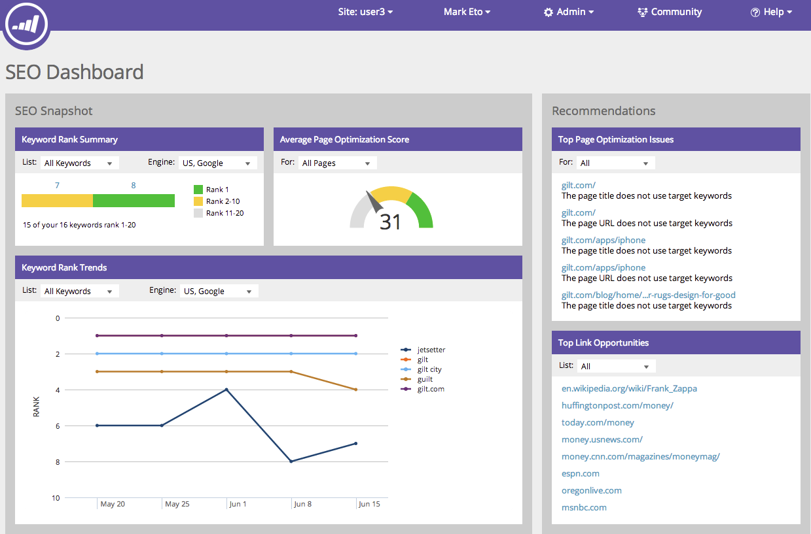

# Explicación del Panel de SEO: Instantánea de SEO {#understanding-the-seo-dashboard-seo-snapshot}

Utilice el panel para obtener una vista de alto nivel de cómo se definen las tendencias en la clasificación de palabras clave y de qué manera se optimiza el sitio para la optimización para SEO.

Para saber en qué centrarse para mejorar los esfuerzos de SEO, utilice la sección de [Recommendations](understanding-the-seo-dashboard-seo-recommendations.md) de este panel.

## Resumen de clasificación de palabras clave {#keyword-rank-summary}

Esta sección muestra cómo se clasifica el sitio para las [palabras clave objetivo](../../../../product-docs/additional-apps/seo/keywords/seo-add-keywords.md).

| Color | Clasificación |
|---|---|
| Verde | Primer resultado en la búsqueda |
| Amarillo | Segundo - Décimo resultado en la búsqueda |
| Gris | 11º - 20º resultado en la búsqueda |

>[!TIP]
>
>También puede vista el rendimiento de una lista  específica de palabras clave. Haga clic en la lista desplegable y seleccione cuál le interesa.

¡Vamos! Sigamos adelante.

## Puntuación promedio de optimización de página {#average-page-optimization-score}

La Puntuación de optimización promedio de la página es una puntuación de mercadotecnia patentada que mide todas las páginas del sitio en una escala de 1 a 100.

Se basa en una recopilación de docenas de mejores prácticas. Un puntaje de 70 o más indica un sitio bien optimizado.

>[!TIP]
>
>También puede ver la puntuación de optimización para listas específicas de páginas. Utilice la lista desplegable y seleccione una que le interese.

## Tendencias de clasificación de palabras clave {#keyword-rank-trends}

El gráfico Tendencias de clasificación de palabras clave extrae las palabras clave con los cinco volúmenes de búsqueda mensuales más altos y grafica cómo se clasifican con el tiempo.

>[!TIP]
>
>Puede eliminar palabras clave de este gráfico haciendo clic en ellas. ¡Pruébelo! El gráfico se reconstruirá dinámicamente.

Fácil, ¿verdad? Ahora veamos la sección de Recommendations de este panel.

>[!MORELIKETHIS]
>
>* [Comprensión del Panel: SEO Recommendations](understanding-the-seo-dashboard-seo-recommendations.md)

>

