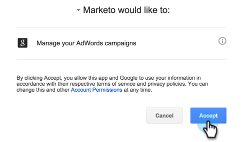

# Añadir Google AdWords como un servicio de LaunchPoint {#add-google-adwords-as-a-launchpoint-service}

Vincule su cuenta de Google AdWords a Marketo para cargar automáticamente los datos de conversión sin conexión de Marketo a Google AdWords. A continuación, desde la interfaz de usuario de AdWords, podrá ver fácilmente qué clics tuvieron como resultado posibles clientes calificados, oportunidades y nuevos clientes (o las etapas de ingresos que desee rastrear) después de [agregar columnas personalizadas](https://support.google.com/adwords/answer/3073556){target=&quot;_blank&quot;} en AdWords. Esta información no aparece en la interfaz de usuario de Marketo.

Más información sobre [Función de importación de conversión sin conexión de Google](https://support.google.com/adwords/answer/2998031?hl=en){target=&quot;_blank&quot;}.

>[!AVAILABILITY]
>
>No todos los clientes han comprado esta función. Póngase en contacto con el gestor de éxito de los clientes para obtener más información.

>[!NOTE]
>
>**Se requieren permisos de administrador**

>[!NOTE]
>
>También puede integrar un [Google AdWords como servicio de punto de inicio con una cuenta de administrador](/help/marketo/product-docs/administration/additional-integrations/add-google-adwords-as-a-launchpoint-service-with-a-manager-account.md){target=&quot;_blank&quot;}.

1. Vaya a la **Administrador** para obtener más información.

   

1. Select **LaunchPoint**.

   

1. Select **Nuevo** y **Nuevo servicio**.

   

1. Introduzca un nombre para mostrar y seleccione **Google AdWords**.

   

1. Select **Autorizar Marketo**.

   >[!NOTE]
   >
   >Asegúrese de cerrar la sesión de su cuenta personal de Gmail y activar ventanas emergentes.

   

1. Seleccione la cuenta asociada a Google AdWords.

   

1. Select **Accept**.

   

1. El estado se mostrará como **Correcto**. Select **Siguiente**.

   

1. Cargar las conversiones sin conexión de Marketo a Google AdWords **Semanal** o **Diario**.

   

1. Conversión de atributos a la variable **Primer clic** o **Último clic**.

   

   | Tipo | Definición |
   |---|---|
   | Primer clic | Las conversiones sin conexión se atribuirán al primer anuncio de AdWords en el que hizo clic una persona en los últimos 90 días |
   | Último clic | Las conversiones sin conexión se atribuirán al último anuncio de AdWords en el que hizo clic una persona |

   >[!NOTE]
   >
   >El uso de un modelo de atribución coherente en Marketo y AdWords proporciona los datos más precisos.

1. Haga clic en **Crear**.

   

   >[!NOTE]
   >
   >[Etiquetado automático](https://support.google.com/adwords/answer/1752125?hl=en){target=&quot;_blank&quot;} debe estar seleccionado para que esta característica funcione. La desactivación debe realizarse dentro de AdWords.

¡Excelente! Ahora, vea el Artículo relacionado a continuación para aprender a asignar conversiones sin conexión de AdWords en su modelo de ingresos.

>[!MORELIKETHIS]
>
>[Definir conversiones de Google AdWords en el modelo de ingresos](/help/marketo/product-docs/reporting/revenue-cycle-analytics/revenue-cycle-models/set-google-adwords-conversions-in-the-revenue-model.md){target=&quot;_blank&quot;}
