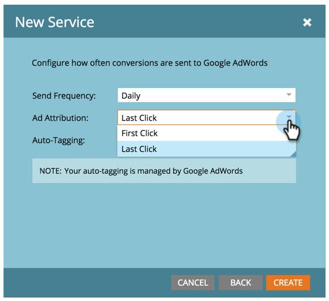

# Agregar [!DNL Google AdWords] como servicio [!DNL LaunchPoint] {#add-google-adwords-as-a-launchpoint-service}

Vincule su cuenta de [!DNL Google AdWords] a Marketo para cargar automáticamente los datos de conversión sin conexión de Marketo a [!DNL Google AdWords]. A continuación, desde la interfaz de usuario de [!DNL AdWords], puede ver qué clics dieron como resultado posibles clientes calificados, oportunidades y nuevos clientes (o las fases de ingresos que desee rastrear) después de [agregar columnas personalizadas](https://support.google.com/adwords/answer/3073556){target="_blank"} en [!DNL AdWords]. Esta información no aparece en la interfaz de usuario de Marketo.

Obtenga más información acerca de la característica de importación de conversión sin conexión de [Google](https://support.google.com/adwords/answer/2998031?hl=en){target="_blank"}.

>[!AVAILABILITY]
>
>No todos los usuarios de Marketo Engage han adquirido esta funcionalidad. Póngase en contacto con el equipo de cuenta de Adobe (su administrador de cuentas) para obtener más información.

>[!NOTE]
>
>**Se requieren permisos de administrador**

>[!NOTE]
>
>También puede integrar un servicio [[!DNL Google AdWords] as a [!DNL Launchpoint] con una cuenta de administrador](/help/marketo/product-docs/administration/additional-integrations/add-google-adwords-as-a-launchpoint-service-with-a-manager-account.md){target="_blank"}.

1. Vaya al área de **[!UICONTROL Admin]**.

   

1. Seleccione **[!UICONTROL LaunchPoint]**.

   

1. Seleccione **[!UICONTROL Nuevo]** y **[!UICONTROL Nuevo servicio]**.

   

1. Escriba un [!UICONTROL nombre para mostrar] y seleccione **[!UICONTROL Google AdWords]**.

   

1. Seleccione **[!UICONTROL Autorizar Marketo]**.

   >[!NOTE]
   >
   >Asegúrese de cerrar la sesión de su cuenta personal de [!DNL Gmail] y habilitar las ventanas emergentes.

   

1. Seleccione la cuenta asociada con [!DNL Google AdWords].

   

1. Seleccione **[!UICONTROL Aceptar]**.

   

1. El estado se muestra como **[!UICONTROL Correcto]**. Seleccione **[!UICONTROL Siguiente]**.

   

1. Cargue sus conversiones sin conexión de Marketo a [!DNL Google AdWords] **[!UICONTROL Semanal]** o **[!UICONTROL Diario]**.

   

1. Conversión de atributos a **[!UICONTROL Primer clic]** o **[!UICONTROL Último clic]**.

   

   | Tipo | Definición |
   |---|---|
   | [!UICONTROL Primer clic] | Las conversiones sin conexión se atribuirán al primer anuncio de [!DNL AdWords] en el que hizo clic una persona en los últimos 90 días |
   | [!UICONTROL Último clic] | Las conversiones sin conexión se atribuirán a los últimos [!DNL AdWords] en los que hizo clic una persona |

   >[!NOTE]
   >
   >El uso de un modelo de atribución coherente en Marketo y [!DNL AdWords] proporciona los datos más precisos.

1. Haga clic en **[!UICONTROL Crear]**.

   

   >[!NOTE]
   >
   >[Se debe seleccionar el etiquetado automático](https://support.google.com/adwords/answer/1752125?hl=en){target="_blank"} para que esta característica funcione. La desactivación debe realizarse dentro de [!DNL AdWords].

Consulte el artículo relacionado siguiente para obtener información sobre cómo asignar [!DNL AdWords] conversiones sin conexión en su modelo de ingresos.
