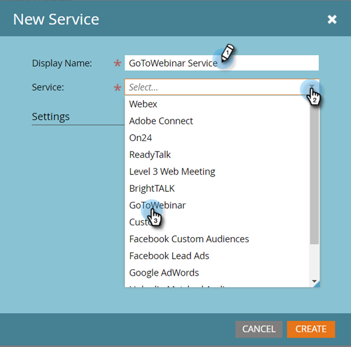

# Añadir GoToWebinar como servicio de LaunchPoint {#add-gotowebinar-as-a-launchpoint-service}

Marketo administra el registro y la asistencia de GoToWebinar.

>[!NOTE]
>
>**Se requieren permisos de administrador**

>[!NOTE]
>
>Para realizar este paso es necesario tener una suscripción existente a GoToWebinar y derechos de administración. Tenga a mano el correo electrónico y la contraseña que usa para iniciar sesión en GoToWebinar.

>[!NOTE]
>
>GoToMeeting, GoToWebcast y GoToTraining no son compatibles actualmente.

1. Vaya a la **Administrador** .

   

1. Haga clic en **LaunchPoint**.

   

1. Select **Nuevo** y **Nuevo servicio**.

   

1. Escriba un **Nombre para mostrar**. En **Servicio**, seleccione **GoToWebinar**.

   

1. A continuación, haga clic en **Iniciar sesión en GoToWebinar**.

   

   >[!NOTE]
   >
   >Si desea sincronizar Nombre de empresa y Título de trabajo del formulario de Marketo con GoToWebinar, seleccione el **Habilitar campos adicionales** en la ventana

1. En la ventana emergente Iniciar sesión en GoToWebinar , introduzca su **GoToWebinar** correo electrónico y contraseña y haga clic en **Iniciar sesión**.

   

1. Una vez cerrada la ventana, haga clic en **Crear**.

   

1. ¡Excelente! Su **GoToWebinar** La cuenta de ahora se sincroniza con Marketo.

   

>[!CAUTION]
>
>Cuando actualice su contraseña en GoToWebinar, también deberá actualizar su contraseña en Marketo.

>[!MORELIKETHIS]
>
>Obtenga información sobre cómo [crear un evento con GotoWebinar](/help/marketo/product-docs/demand-generation/events/create-an-event/create-an-event-with-gotowebinar.md){target=&quot;_blank&quot;}.
