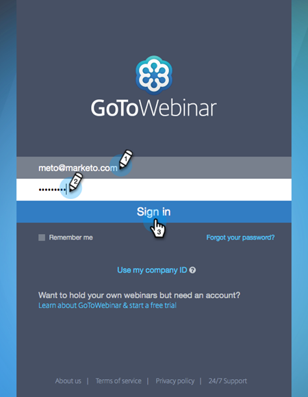

# Agregar [!DNL GoToWebinar] como servicio [!DNL LaunchPoint] {#add-gotowebinar-as-a-launchpoint-service}

Marketo administra el registro y la asistencia de [!DNL GoToWebinar].

>[!NOTE]
>
>**Se requieren permisos de administrador**

>[!NOTE]
>
>Se necesita una suscripción existente a [!DNL GoToWebinar] y derechos de administración para este paso. Tenga a mano el correo electrónico y la contraseña que utiliza para iniciar sesión en [!DNL GoToWebinar].

>[!NOTE]
>
>[!DNL GoToMeeting], [!DNL GoToWebcast] y [!DNL GoToTraining] no son compatibles actualmente.

1. Vaya al área de **[!UICONTROL Admin]**.

   

1. Haga clic en **[!UICONTROL LaunchPoint]**.

   

1. Seleccione **[!UICONTROL Nuevo]** y **[!UICONTROL Nuevo servicio]**.

   

1. Escriba un **[!UICONTROL Nombre para mostrar]**. En **[!UICONTROL Servicio]**, seleccione **[!UICONTROL IrAlSeminarioWeb]**.

   

1. Haga clic en **[!UICONTROL Iniciar sesión en GoToWebinar]**.

   

   >[!NOTE]
   >
   >Si desea sincronizar el nombre de la empresa y el puesto del formulario de Marketo con [!DNL GoToWebinar], active la casilla **[!UICONTROL Habilitar campos adicionales]**.

1. En la ventana emergente de inicio de sesión de [!DNL GoToWebinar], escribe el correo electrónico y la contraseña de **[!UICONTROL GoToWebinar]** y haz clic en **[!UICONTROL Iniciar sesión]**.

   

1. Una vez cerrada la ventana, haz clic en **[!UICONTROL Crear]**.

   

1. Su cuenta de **[!UICONTROL GoToWebinar]** ahora está sincronizada con Marketo.

   

>[!CAUTION]
>
>Cuando actualice la contraseña en [!DNL GoToWebinar], también deberá actualizarla en Marketo.

>[!MORELIKETHIS]
>
>Aprenda a [crear un evento con [!DNL GotoWebinar]](/help/marketo/product-docs/demand-generation/events/create-an-event/create-an-event-with-gotowebinar.md){target="_blank"}.
