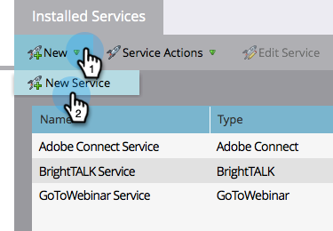

# Añadir [!DNL Level 3 Web Meeting] as a [!DNL LaunchPoint] Servicio {#add-level-three-web-meeting-as-a-launchpoint-service}

Marketo administra su [!DNL Level 3 Web Meeting] registro y asistencia.

>[!NOTE]
>
>**Permisos de administración necesarios**

>[!NOTE]
>
>Una suscripción existente a [!DNL Level 3 Web Meeting] Los derechos de administración de y son necesarios para este paso. Tenga a mano su número de acceso, código de acceso y contraseña.

1. Vaya a la **[!UICONTROL Administrador]** área.

   

1. Clic **[!UICONTROL LaunchPoint]**.

   

1. Seleccionar **[!UICONTROL Nuevo]** y luego **[!UICONTROL Nuevo servicio]**.

   

1. Introduzca una **[!UICONTROL Nombre para mostrar]**. En **[!UICONTROL Servicio]**, seleccione **[!UICONTROL Reunión web del nivel 3]**.

   

1. Introduzca su **[!UICONTROL Número de acceso]**, **[!UICONTROL Código de acceso]**, y **[!UICONTROL Contraseña]**, luego haga clic en **[!UICONTROL Crear]**.

   

Su [!DNL Level 3 Web Meeting] La cuenta ya se ha sincronizado con Marketo.

>[!MORELIKETHIS]
>
>Obtenga información sobre cómo [cree un evento con una [!DNL Level 3 Web Meeting]](/help/marketo/product-docs/demand-generation/events/create-an-event/create-an-event-with-level-3-web-meeting.md){target="_blank"}.
