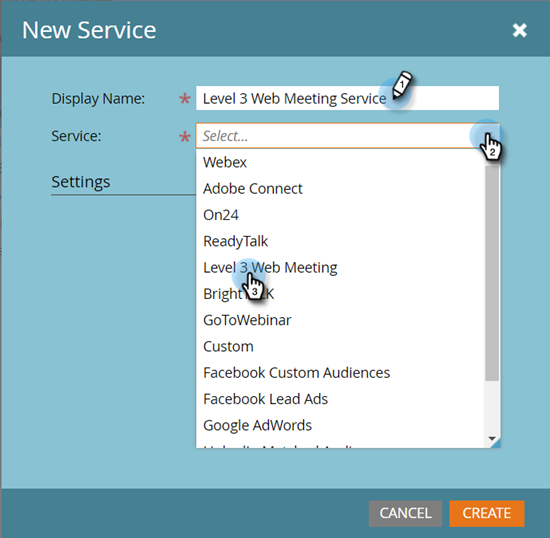
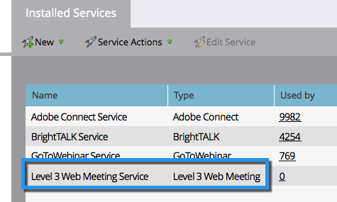

# Agregar una reunión web de nivel 3 como servicio de LaunchPoint {#add-level-three-web-meeting-as-a-launchpoint-service}

Marketo administra el registro y la asistencia a la reunión web de nivel 3.

>[!NOTE]
>
>**Se requieren permisos de administrador**

>[!NOTE]
>
>Para realizar este paso es necesario tener una suscripción existente a los derechos de administración y reunión web de nivel 3. Tenga a mano el número de acceso, el código de acceso y la contraseña.

1. Vaya a la **Administrador** .

   

1. Haga clic en **LaunchPoint**.

   

1. Select **Nuevo** y luego **Nuevo servicio**.

   

1. Escriba un **Nombre para mostrar**. En **Servicio**, seleccione **Reunión web de nivel 3**.

   

1. Escriba la **Número de acceso**, **Código de acceso** y **Código de contraseña** y haga clic en **Crear**.

   

Su cuenta de reunión web de nivel 3 ya está sincronizada con Marketo.

>[!MORELIKETHIS]
>
>Obtenga información sobre cómo [crear un evento con una reunión web de nivel 3](/help/marketo/product-docs/demand-generation/events/create-an-event/create-an-event-with-level-3-web-meeting.md){target=&quot;_blank&quot;}.
