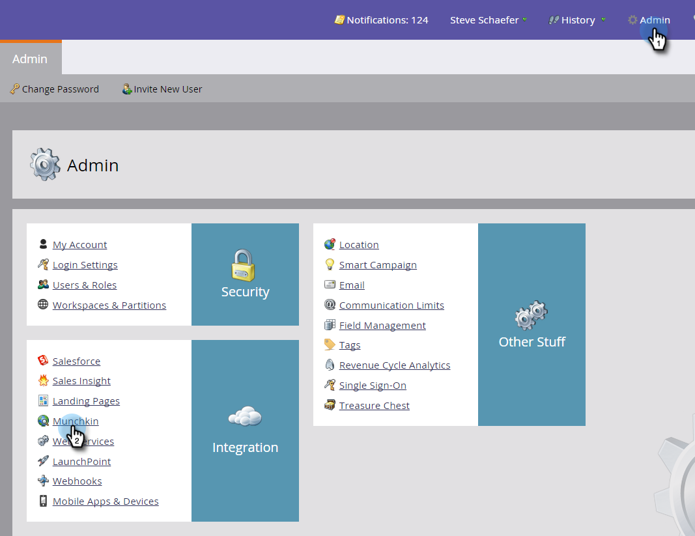
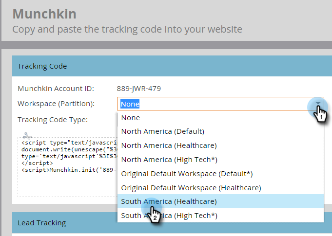
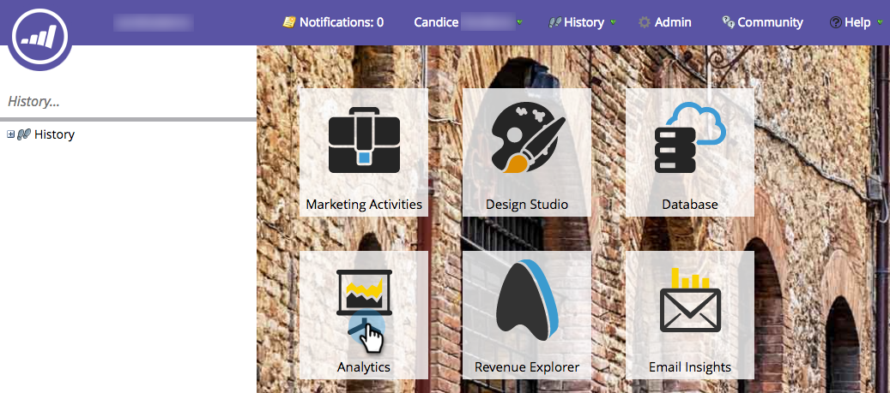

# Agregar código de seguimiento de Munchkin a su sitio web {#add-munchkin-tracking-code-to-your-website}

El código de seguimiento personalizado de JavaScript de Marketo, llamado Munchkin, rastrea a todas las personas que visitan su sitio web para que pueda reaccionar a sus visitas mediante campañas de marketing automatizadas. Incluso se realiza un seguimiento de los visitantes anónimos junto con sus direcciones IP y otra información. **Sin este código de seguimiento, no podrá rastrear visitas u otra actividad en su sitio web**.

>[!PREREQUISITES]
>
>Asegúrese de tener acceso a un desarrollador de JavaScript experimentado. La asistencia técnica de Marketo no está configurada para ayudar a solucionar problemas de JavaScript personalizado.

## Agregar código de seguimiento al sitio web {#add-tracking-code-to-your-website}

>[!NOTE]
>
>Los clientes de Adobe Experience Cloud también pueden utilizar la integración de Marketo en Adobe Launch para incluir el script Munchkin en sus páginas web. Obtenga la aplicación [aquí](https://www.adobeexchange.com/experiencecloud.details.101054.html).

1. Vaya a **Admin** y haga clic en **Munchkin** en el árbol de la izquierda.

   

   Seleccione Asincrónico para Tipo de código de seguimiento.

   

   >[!NOTE]
   >
   >En casi todos los casos, debe utilizar el código asincrónico. [Más información.](#types-of-munchkin-tracking-codes)

   Haga clic en y copie el código de seguimiento de Javascript para colocarlo en su sitio web.

   

   >[!CAUTION]
   >
   >No use el código que se muestra en esta captura de pantalla: debe utilizar el código único que aparece en la cuenta.

   >[!TIP]
   >
   >Coloque el código de seguimiento en las páginas web que desee rastrear. Puede tratarse de todas las páginas de sitios más pequeños o solo de páginas clave de sitios que tengan muchas páginas web generadas dinámicamente, foros de usuarios, etc.

   Para obtener mejores resultados, utilice el código de Munchkin asincrónico y colóquelo dentro de los elementos `<head>` de sus páginas. Si está utilizando el código simple (no recomendado), esto es justo antes de la etiqueta `</body>` .
   

>[!TIP]
>
>Para los sitios que ven un gran volumen de tráfico (es decir, cientos de miles de visitas al mes), le recomendamos que no siga a las personas anónimas. [Más información](https://developers.marketo.com/documentation/websites/lead-tracking-munchkin-js/).

## Agregar código de seguimiento al usar varios espacios de trabajo {#add-tracking-code-when-using-multiple-workspaces}

Si utiliza Workspaces en su cuenta de Marketo, probablemente también tenga presencias web independientes que se correspondan con sus espacios de trabajo. En ese caso, puede utilizar el Javascript de seguimiento de Munchkin para asignar a sus personas anónimas al espacio de trabajo y la partición correctos.

1. Vaya a **Admin** y haga clic en **Munchkin** en el árbol de la izquierda.

1. Seleccione el espacio de trabajo adecuado para las páginas web que desee rastrear.

   

>[!NOTE]
>
>Si no utiliza el código especial de espacio de trabajo de Munchkin, las personas se asignarán a la partición predeterminada que se creó cuando su cuenta se configuró. Inicialmente se denomina &quot;Predeterminado&quot;, pero es posible que lo haya cambiado en su propia cuenta de Marketo.

1. Seleccione **Asincrónico** para Tipo de código de seguimiento.

   

1. Haga clic en y copie el código de seguimiento de JavaScript para colocarlo en el sitio web.

   

   >[!CAUTION]
   >
   >No use el código que se muestra en esta captura de pantalla: debe utilizar el código único que aparece en la cuenta.

1. Coloque el código de seguimiento en las páginas web en el elemento `<head>` . Las personas nuevas que visiten esta página se asignarán a esta partición.

   

>[!CAUTION]
>
>Solo puede utilizar un script de seguimiento Munchkin para una sola partición y espacio de trabajo en una página. No incluya scripts de seguimiento para varias particiones/espacios de trabajo en el sitio web.

>[!NOTE]
>
>Las páginas de aterrizaje creadas en Marketo contienen automáticamente código de seguimiento, por lo que no es necesario ponerles este código.

## Tipos de códigos de seguimiento de Munchkin {#types-of-munchkin-tracking-codes}

Existen tres tipos de códigos de seguimiento de Munchkin entre los que puede elegir. Cada uno de ellos afecta a los tiempos de carga de las páginas web de forma diferente.

1. **Simple**: tiene la menor cantidad de líneas de código, pero no optimiza el tiempo de carga de las páginas web. Este código carga la biblioteca jQuery cada vez que se carga una página web.
1. **Asíncrono**: reduce el tiempo de carga de las páginas web.
1. **jQuery** asíncrono: reduce el tiempo de carga de las páginas web y también mejora el rendimiento del sistema. Este código supone que ya tiene jQuery y no lo comprueba para cargarlo.

## Pruebe si el código de Munchkin funciona {#test-if-your-munchkin-code-is-working}

Para comprobar que su código Munchkin funciona después de agregarlo:

1. Visite su página web.

1. Vaya a **Analytics**.

   

1. Haga clic en **Actividad de página web**.

   

1. Haga clic en la pestaña **Configuración**, haga doble clic en **Fuente de actividad** y cambie a **Visitantes anónimos (incluidos los ISP)**.

   

   

1. Haga clic en la pestaña **Report**. Si no ve ningún dato, espere unos minutos y luego haga clic en el icono de actualización en la parte inferior.
