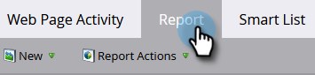

# Agregar código de seguimiento [!DNL Munchkin] al sitio web {#add-munchkin-tracking-code-to-your-website}

El código de seguimiento personalizado de JavaScript de Marketo, denominado [!DNL Munchkin], registra a todas las personas que visitan su sitio web para que pueda reaccionar a sus visitas con campañas de marketing automatizadas. Incluso los visitantes anónimos se rastrean junto con sus direcciones IP y otra información. **Sin este código de seguimiento, no podrá rastrear visitas u otras actividades en su sitio web**.

>[!PREREQUISITES]
>
>Asegúrese de tener acceso a un desarrollador de JavaScript experimentado. La asistencia técnica de Marketo no está configurada para ayudar a solucionar problemas de JavaScript personalizado.

## Añadir código de seguimiento a su sitio web {#add-tracking-code-to-your-website}

>[!NOTE]
>
>Los usuarios de Adobe Experience Cloud también pueden usar la integración de [Marketo en Adobe Launch](https://exchange.adobe.com/apps/ec/100223/adobe-launch-core-extension){target="_blank"} para incluir el script [!DNL Munchkin] en sus páginas web. Si usa Adobe Launch, _el script [!DNL Munchkin] se agrega automáticamente_, por lo que no necesitará agregarlo usted mismo.

1. Vaya al área de **[!UICONTROL Admin]**.

   

1. Haga clic en **[!UICONTROL Munchkin]**.

   

1. Seleccione **[!UICONTROL Asincrónica]** para **[!UICONTROL Tipo de código de seguimiento]**.

   

   >[!NOTE]
   >
   >En casi todos los casos, debe utilizar el código asincrónico. [Más información](#types-of-munchkin-tracking-codes).

1. Haga clic en y copie el código de seguimiento de Javascript que desea colocar en el sitio web.

   

   >[!CAUTION]
   >
   >No use el código mostrado en esta captura de pantalla: debe usar el código único que aparece en su cuenta.

   >[!TIP]
   >
   >Coloque el código de seguimiento en las páginas web que desee rastrear. Esto puede ser cada página para sitios más pequeños o solo páginas clave en sitios que tienen muchas páginas web generadas dinámicamente, foros de usuarios, etc.

   Para obtener los mejores resultados, use el código [!DNL Munchkin] asincrónico y colóquelo dentro de los elementos `<head>` de sus páginas. Si utiliza código simple (no recomendado), justo antes de la etiqueta `</body>`.

   

   >[!TIP]
   >
   >Para los sitios que ven un gran volumen de tráfico (es decir, cientos de miles de visitas al mes), le recomendamos que opte por no rastrear a personas anónimas. [Más información](https://experienceleague.adobe.com/es/docs/marketo-developer/marketo/javascriptapi/leadtracking/lead-tracking){target="_blank"}.

## Añadir código de seguimiento al usar varios espacios de trabajo {#add-tracking-code-when-using-multiple-workspaces}

Si utiliza espacios de trabajo en su cuenta de Marketo, es probable que también tenga presencias web independientes que se correspondan con los espacios de trabajo. En ese caso, puede usar el JavaScript de seguimiento [!DNL Munchkin] para asignar a los usuarios anónimos al espacio de trabajo y la partición correctos.

1. Vaya al área de **[!UICONTROL Admin]**.

   

1. Haga clic en **[!UICONTROL Munchkin]**.

   

1. Seleccione el espacio de trabajo adecuado para las páginas web que desee rastrear.

   

   >[!NOTE]
   >
   >Si no usa el código de área de trabajo especial [!DNL Munchkin], las personas se asignarán a la partición predeterminada que se creó con la configuración de la cuenta. Inicialmente se denomina &quot;[!UICONTROL Default]&quot;, pero es posible que lo haya cambiado en su propia cuenta de Marketo.

1. Seleccione **[!UICONTROL Asincrónica]** para **[!UICONTROL Tipo de código de seguimiento]**.

   

1. Haga clic en y copie el código de seguimiento de JavaScript que desea colocar en el sitio web.

   

   >[!CAUTION]
   >
   >No use el código mostrado en esta captura de pantalla: debe usar el código único que aparece en su cuenta.

1. Coloque el código de seguimiento en las páginas web en el elemento `<head>`. Las personas nuevas que visiten esta página se asignarán a esta partición.

   

   >[!CAUTION]
   >
   >Solo puede usar un script de seguimiento [!DNL Munchkin] para una sola partición y área de trabajo en una página. No incluya scripts de seguimiento para varias particiones o espacios de trabajo en el sitio web.

   >[!NOTE]
   >
   >Las páginas de aterrizaje creadas en Marketo contienen automáticamente código de seguimiento, por lo que no es necesario colocarlo.

## Tipos de [!DNL Munchkin] códigos de seguimiento {#types-of-munchkin-tracking-codes}

Existen tres tipos de códigos de seguimiento [!DNL Munchkin] entre los que puede elegir. Cada impacto en los tiempos de carga de la página web es diferente.

1. **[!UICONTROL Simple]**: tiene menos líneas de código, pero no optimiza el tiempo de carga de la página web. Este código carga la biblioteca jQuery cada vez que se carga una página web.
1. **[!UICONTROL Asincrónica]**: reduce el tiempo de carga de la página web.
1. **[!UICONTROL jQuery asincrónico]**: reduce el tiempo de carga de la página web y también mejora el rendimiento del sistema. Este código supone que ya tiene jQuery y no marca la casilla para cargarlo.

## Comprobar si el código [!DNL Munchkin] funciona {#test-if-your-munchkin-code-is-working}

Para comprobar que el código [!DNL Munchkin] funciona después de agregarlo:

1. Visite su página web.

1. En su [!DNL My Marketo], haga clic en el mosaico **[!UICONTROL Analytics]**.

   

1. Haga clic en **[!UICONTROL Actividad de página web]**.

   

1. Haga clic en la ficha **[!UICONTROL Configuración]**, haga doble clic en **[!UICONTROL Activity Source]**.

   

1. Cambie [!UICONTROL Activity Source] por **[!UICONTROL Visitantes anónimos (incluidos ISP)]** y haga clic en **[!UICONTROL Aplicar]**.

   

1. Haga clic en la ficha **[!UICONTROL Informe]**.

   

   >[!NOTE]
   >
   >Si no ve ningún dato, espere unos minutos y, a continuación, haga clic en el icono de actualización situado en la parte inferior.
