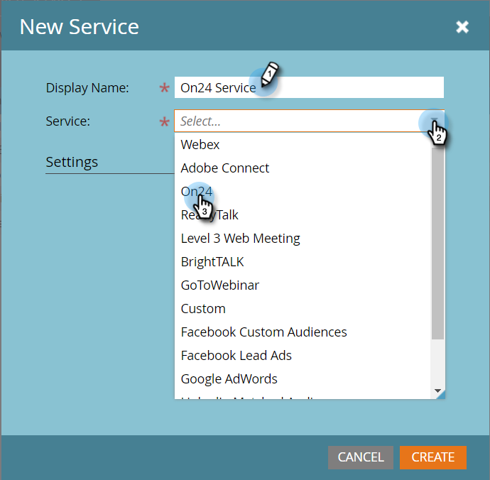

# Añadir ON24 como un servicio de LaunchPoint {#add-on-as-a-launchpoint-service}

Marketo administra su inscripción y asistencia al seminario web ON24.

>[!NOTE]
>
>**Se requieren permisos de administrador**

>[!NOTE]
>
>Para realizar este paso es necesaria una suscripción existente a ON24 y derechos de administración. Tenga a mano la siguiente configuración: Clave de cliente e ID de cliente. Puede obtener el ID de cliente y la clave de cliente directamente desde el administrador de cuentas de ON24.

1. Vaya a **Admin** y haga clic en **LaunchPoint**.

   

1. Seleccione **Nuevo** y, a continuación, **Nuevo servicio**.

   

1. Introduzca un **Nombre para mostrar**. En **Service**, seleccione **ON24**.

   

1. Complete el proceso introduciendo su **Client Key** y **Client ID** en **Settings** y luego haga clic en **Create**.

   

1. Su cuenta **ON24** ahora está sincronizada con Marketo.

   

>[!MORELIKETHIS]
>
>Aprenda a [crear su evento de seminario web en ON24](/help/marketo/product-docs/demand-generation/events/create-an-event/create-an-event-with-the-marketo-on24-adapter/create-your-webinar-event-in-on24.md).
