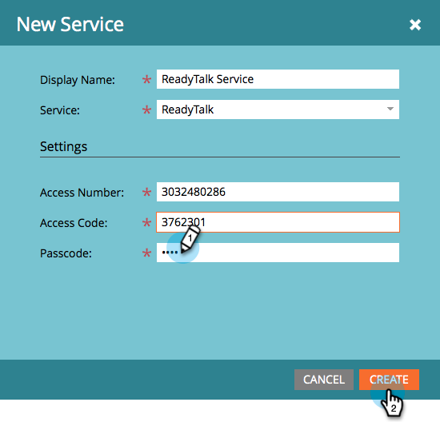

# Agregar ReadyTalk como un servicio de LaunchPoint {#add-readytalk-as-a-launchpoint-service}

Marketo administra el registro y la asistencia a los seminarios web de ReadyTalk.

>[!NOTE]
>
>**Se requieren permisos de administrador**

>[!NOTE]
>
>Para realizar este paso es necesaria una suscripción existente a los derechos de administración y de ReadyTalk. Tenga a mano la siguiente configuración: Número de acceso, código de acceso y código de contraseña.

1. Vaya a la **Administrador** .

   

1. Haga clic en **LaunchPoint**.

   

1. Select **Nuevo** y luego **Nuevo servicio**.

   

1. Escriba un **Nombre para mostrar**. En **Servicio**, seleccione **ReadyTalk**.

   

1. Escriba la **Número de acceso** y **Código de acceso**.

   

1. Complete el proceso introduciendo su **Código de contraseña** y haga clic en **Crear**.

   

Su **ReadyTalk** La cuenta de ahora se sincroniza con Marketo.

>[!MORELIKETHIS]
>
>Obtenga información sobre cómo [crear un evento con ReadyTalk](/help/marketo/product-docs/demand-generation/events/create-an-event/create-an-event-with-readytalk.md).
