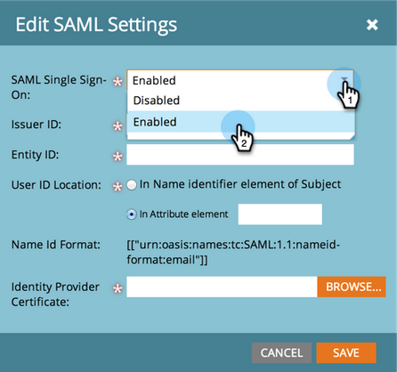
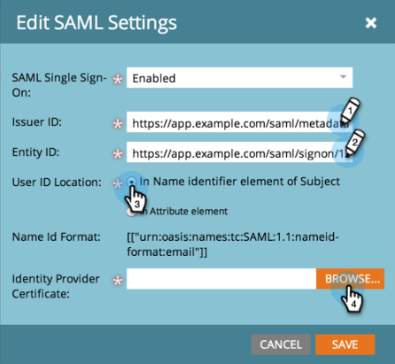

# Agregar el inicio de sesión único a un portal {#add-single-sign-on-to-a-portal}

Si tiene un servicio de directorio que autentica a los usuarios, puede permitir el inicio de sesión único (SSO) en Marketo. Se admite esta característica con [!DNL Security Assertion Markup Language] (SAML) versión 2.0 y posteriores.

Marketo funciona como un proveedor de servicios SAML (SP) y depende de un proveedor de identidad externo (IdP) para autenticar a los usuarios.

Una vez habilitado el SSO, el IdP puede validar las credenciales de un usuario. Cuando un usuario desea utilizar el software de Marketo, el IdP envía un mensaje SAML firmado a Marketo, que actúa como SP. Este mensaje garantiza a Marketo que el usuario está autorizado a utilizar el software de Marketo.

>[!NOTE]
>
>**Se requieren permisos de administración**

>[!IMPORTANT]
>
>Esto no se aplica a las suscripciones incorporadas a Adobe Identity. Para las suscripciones integradas en Adobe Identity, el inicio de sesión único se configura en el nivel de organización de Adobe en Adobe Admin Console. Adobe Admin Console solo admite SP-iniciado en este momento. [Obtenga más información aquí](https://helpx.adobe.com/es/enterprise/using/set-up-identity.html){target="_blank"}.

>[!NOTE]
>
>¿Es un usuario de [!DNL Microsoft Azure]? Consulte su [tutorial de integración](https://learn.microsoft.com/en-us/entra/identity/saas-apps/marketo-tutorial){target="_blank"}. Para su información, hay un error tipográfico en el paso 5c de su tutorial. Establezca el estado de retransmisión en `https://<munchkinid>.mktoweb.com`, **_no_** `https://<munchkinid>.marketo.com`.

## Cómo enviar la solicitud {#how-to-send-the-request}

* Enviar la solicitud SSO, que es una respuesta SAML, a `https://login.marketo.com/saml/assertion/<your-munchkin-id>`
* Como URL de audiencia del SP. Usar `http://saml.marketo.com/sp`
* Si está usando el atributo SPNameQualifier, establezca el elemento NameID del asunto en `http://saml.marketo.com/sp`
* Si está federando varias suscripciones de Marketo al mismo proveedor de SSO, puede utilizar direcciones URL de SP únicas para cada subrutina de Marketo con el formato `http://saml.marketo.com/sp/<munchkin_id>`

>[!NOTE]
>
>Marketo solo admite el inicio del proveedor de identidad (también conocido como inicio de IdP), en el que el usuario inicia primero la página de inicio de sesión de IdP, se autentica y, a continuación, navega a Mi Marketo. Si la suscripción de Marketo se ha movido a Admin Console, Adobe Admin Console solo admite servicios iniciados por Service Provider (también conocidos como iniciados por SP) en este momento. Es posible que se hayan realizado cambios en su experiencia de SSO.

## Notas adicionales {#additional-notes}

* **Tiempo de sincronización**: para un usuario nuevo, hay un retraso de unos 10 minutos antes de que se procese una solicitud de SSO inicial.
* **Aprovisionamiento de usuarios**: Marketo aprovisiona a los usuarios manualmente.
* **Autorización**: los permisos de usuario se mantienen en Marketo.
* **Compatibilidad con OAuth**: Marketo no admite OAuth en este momento.
* **Propagación automática del usuario** - También conocida como &quot;Aprovisionamiento justo a tiempo&quot;, es cuando el primer inicio de sesión de SAML de un usuario puede crearlo en cualquier aplicación web a la que acceda (por ejemplo, Marketo) y no se requiere ninguna acción de administración manual. Esto no es compatible con Marketo en este momento.
* **Cifrado**: Marketo no admite actualmente el cifrado.

>[!NOTE]
>
>Antes de empezar, tenga el certificado de proveedor de identidad en formato X.509 y en la extensión .crt, .der o .cer.

## Actualizar configuración de SAML {#update-saml-settings}

SSO está desactivado de forma predeterminada. Siga estos pasos para habilitar SAML y configurarlo.

1. Vaya al área de **[!UICONTROL Admin]**.

   

1. Haga clic en **[!UICONTROL Inicio de sesión único]**.

   

   >[!NOTE]
   >
   >Si no ve **[!UICONTROL Inicio de sesión único]** en **[!UICONTROL Administración]**, comuníquese con la [Asistencia de Marketo](https://nation.marketo.com/t5/Support/ct-p/Support){target="_blank"}.

1. En la sección **[!UICONTROL Configuración de SAML]**, haga clic en **[!UICONTROL Editar]**.

   

1. Cambiar **[!UICONTROL inicio de sesión único de SAML]** a **[!UICONTROL Habilitado]**.

   

1. Escriba su **[!UICONTROL ID de emisor]**, **[!UICONTROL ID de entidad]**, seleccione la **[!UICONTROL ubicación del ID de usuario]** y, a continuación, haga clic en **[!UICONTROL Examinar]**.

   

1. Seleccione el archivo **[!UICONTROL Certificado de proveedor de identidad]**.

   

1. Haga clic en **[!UICONTROL Guardar]**.

   

## Actualizar configuración de página de redireccionamiento {#update-redirect-page-settings}

1. En la sección **[!UICONTROL Redirigir páginas]**, haga clic en **[!UICONTROL Editar]**.

   

   >[!NOTE]
   >
   >Los clientes que usan el identificador universal junto con el SSO deben ingresar la URL de inicio de sesión del proveedor de identidad en el campo **[!UICONTROL URL de inicio de sesión]**.

1. Escriba una **[!UICONTROL URL de cierre de sesión]**. Dirección URL a la que desea que se dirija al usuario cuando cierre la sesión de Marketo.

   

1. Escriba una **[!UICONTROL URL con error]**. Dirección URL a la que desea que se dirija al usuario en caso de que falle el inicio de sesión en Marketo. Haga clic en **[!UICONTROL Guardar]**.

   

   >[!NOTE]
   >
   >Ambas páginas deben estar disponibles para el público.

>[!MORELIKETHIS]
>
>* [Usando un identificador universal para el inicio de sesión con suscripción](/help/marketo/product-docs/administration/settings/using-a-universal-id-for-subscription-login.md){target="_blank"}
>* [Restringir el inicio de sesión del usuario solo a SSO](/help/marketo/product-docs/administration/additional-integrations/restrict-user-login-to-sso-only.md){target="_blank"}
>* [Invitar a usuarios de Marketo a dos instancias con identificador universal](https://nation.marketo.com/t5/Knowledgebase/Inviting-Marketo-Users-to-Two-Instances-with-Universal-ID-UID/ta-p/251122){target="_blank"}
