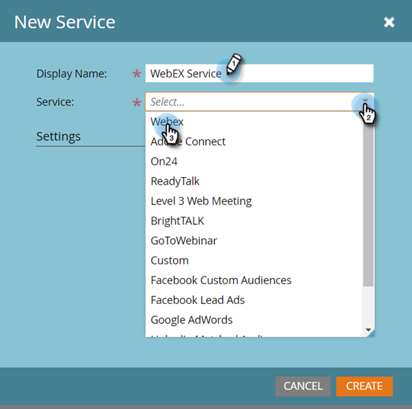

# Agregar [!DNL Webex] como servicio [!DNL LaunchPoint] {#add-webex-as-a-launchpoint-service}

Marketo Engage administra el registro y la asistencia a [!DNL Webex] seminarios web. Debe tener una suscripción existente a [[!UICONTROL Webex]](https://www.webex.com/).

>[!NOTE]
>
>**Se requieren permisos de administrador**

1. Vaya al área de **[!UICONTROL Admin]**.

   

1. Haga clic en **[!UICONTROL LaunchPoint]**.

   

1. Seleccione **[!UICONTROL Nuevo]** y después **[!UICONTROL Nuevo servicio]**.

   

1. Escriba un **[!UICONTROL Nombre para mostrar]**. En el menú desplegable **[!UICONTROL Servicio]**, seleccione **[!UICONTROL Seminarios web de Webex]**.

   

1. Haga Clic En **[!UICONTROL Iniciar Sesión En Webinars De Webex]**.

   

1. Webex se abre en una nueva pestaña. Inicie sesión con sus credenciales de Webex.

   

1. Una vez que el inicio de sesión se haya realizado correctamente, la pestaña se cerrará y el modal _New Service_ de Marketo Engage indicará &quot;La cuenta de Webex Webinars está establecida&quot;. Haga clic en **[!UICONTROL Crear]**.

   

Su **[!DNL Webex]** se ha sincronizado con Marketo.

>[!MORELIKETHIS]
>
>[Crear un evento con [!DNL Webex]](/help/marketo/product-docs/demand-generation/events/create-an-event/create-an-event-with-webex.md){target="_blank"}.
