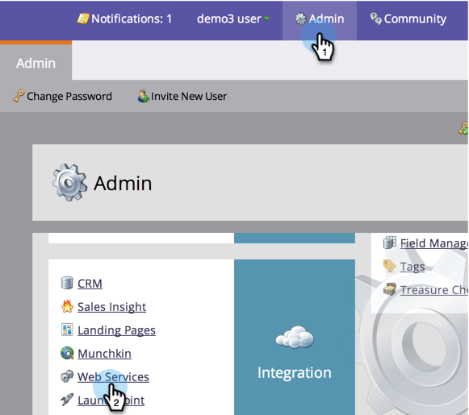
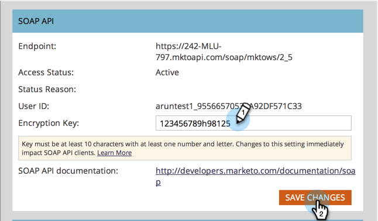

# Configuración de la API SOAP {#configuring-your-soap-api-settings}

>[!NOTE]
>
>Sugerimos utilizar la API de REST. Obtenga más información sobre [developers.marketo.com](https://developers.marketo.com/documentation/rest/).

>[!NOTE]
>
>**Se requieren permisos de administrador**

1. Vaya a **Admin** y haga clic en **Servicios Web**.

   

1. Configure una **Clave de cifrado** adecuada, haga clic en **Guardar cambios** y pase toda la información a su desarrollador.

   

>[!CAUTION]
>
>El extremo SOAP y el ID de usuario serán únicos; no envíe la captura de pantalla de este artículo a su desarrollador.

>[!MORELIKETHIS]
>
>[Documentación de API SOAP](https://developers.marketo.com/documentation/soap/)
