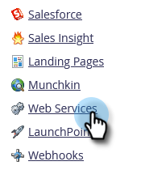

# Configuración de la API de SOAP {#configuring-your-soap-api-settings}

>[!NOTE]
>
>Se recomienda utilizar la API de REST. Más información en [developer.adobe.com](https://developer.adobe.com/marketo-apis/).

>[!NOTE]
>
>**Se requieren permisos de administrador**

1. Vaya al área de **[!UICONTROL Admin]**.

   

1. Haga clic en **[!UICONTROL Servicios web]**.

   

1. Establece una **[!UICONTROL clave de cifrado]** adecuada, haz clic en **[!UICONTROL Guardar cambios]** y pasa toda la información a tu desarrollador.

   

>[!CAUTION]
>
>El extremo de SOAP y [!UICONTROL Id. de usuario] serán únicos; no envíe la captura de pantalla de este artículo a su Desarrollador.

>[!MORELIKETHIS]
>
>[Documentación de la API de SOAP](https://experienceleague.adobe.com/en/docs/marketo-developer/marketo/soap/soap-api)
