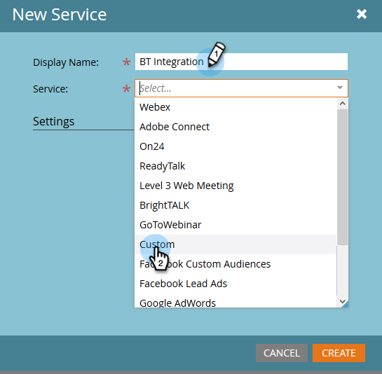
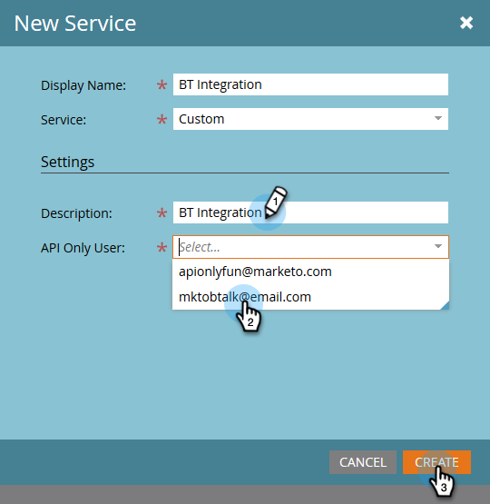
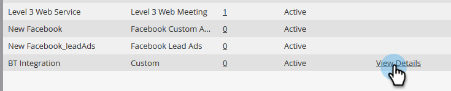
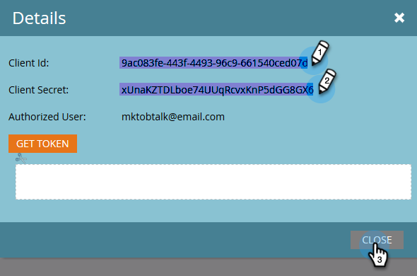

# Conectar [!DNL BrightTALK] a Marketo {#connect-brighttalk-to-marketo}

Aprenda a conectar el canal [!DNL BrightTALK] a la instancia de Marketo. Para ello, debe ser administrador de ambos.

>[!NOTE]
>
>**Se requieren permisos de administrador**

## Pasos en [!DNL BrightTALK] {#steps-in-brighttalk}

1. Inicie sesión en [business.brighttalk.com/demandcentral](https://business.brighttalk.com/demandcentral/login){target="_blank"} y haga clic en **[!UICONTROL Conectar ahora]**.

1. En [!UICONTROL Conector de Marketo avanzado], haga clic en **[!UICONTROL Conectar]**.

1. Aparece la pantalla de credenciales que solicita: ID de cliente, secreto de cliente, URL del servicio de identidad y URL del servicio REST. Para obtener esta información, inicie sesión en Marketo.

## Pasos en Marketo {#steps-in-marketo}

>[!NOTE]
>
>En este momento se le requiere que configure un [!DNL API Only User Role] y [!DNL API User] para restringir los permisos que tendrá [!DNL BrightTALK] en su instancia de Marketo. Los artículos están disponibles para esos pasos.

1. Crear un [Rol de usuario solo API](/help/marketo/product-docs/administration/users-and-roles/create-an-api-only-user-role.md){target="_blank"}.

1. [Cree un usuario de API](/help/marketo/product-docs/administration/users-and-roles/create-api-only-user.md){target="_blank"}, usando la función de API [!DNL BrightTALK] que creó durante el paso 4.

1. Vuelva al área **[!UICONTROL Administrador]**.

   

1. En **[!UICONTROL Integración]**, haga clic en **[!UICONTROL LaunchPoint]**.

   

1. Haga clic en el menú desplegable **[!UICONTROL Nuevo]** y seleccione **[!UICONTROL Nuevo servicio]**.

   

1. Escriba un **[!UICONTROL Nombre para mostrar]** de su elección. Haga clic en el menú desplegable **[!UICONTROL Servicio]** y seleccione **[!UICONTROL Personalizado]** (haga clic en _no_ y seleccione [!DNL BrightTALK]).

   

   >[!CAUTION]
   >
   >Recuerde no seleccionar [!DNL BrightTALK] en la lista desplegable. Este campo se está eliminando y, si lo selecciona, podrían producirse problemas importantes con la integración de [!DNL Marketo/BrightTALK].

1. Escriba una [!UICONTROL descripción] de su elección. Haga clic en el menú desplegable **[!UICONTROL Usuario solo de API]** y seleccione [!DNL BrightTALK API User] que creó durante el paso 5. Haga clic en **[!UICONTROL Crear]**.

   

1. Haga clic en **[!UICONTROL Ver detalles]** para el servicio personalizado que acaba de crear.

   

1. Copie (y guarde) **[!UICONTROL ID de cliente]** y **[!UICONTROL Secreto de cliente]**. Haga clic en **[!UICONTROL Cerrar]**.

   

1. En **[!UICONTROL Integración]**, seleccione **[!UICONTROL Servicios web]**.

   

1. En **[!UICONTROL API de REST]**, copie (y guarde) el **[!UICONTROL extremo]** y la **[!UICONTROL identidad]**.

   

## Pasos adicionales en [!DNL BrightTALK] {#additional-steps-in-brighttalk}

1. Vuelva a la pantalla de configuración del conector [!DNL BrightTALK] desde el paso 3 e introduzca las credenciales que guardó desde los pasos 12 y 14.

Una vez autenticadas las credenciales, ha conectado oficialmente [!DNL BrightTALK] a Marketo. El siguiente paso es determinar qué campos de datos desea sincronizar. Si necesita ayuda, comuníquese con la [asistencia técnica de BrightTALK](https://www.brighttalk.com/){target="_blank"}.
