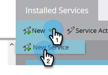

# Connect [!DNL BrightTALK] a MARKETO {#connect-brighttalk-to-marketo}

Obtenga información sobre cómo conectar su [!DNL BrightTALK] a su instancia de Marketo. Para ello, debe ser administrador de ambos.

>[!NOTE]
>
>**Permisos de administración necesarios**

## Pasos en [!DNL BrightTALK] {#steps-in-brighttalk}

1. Iniciar sesión en [business.brighttalk.com/demandcentral](https://business.brighttalk.com/demandcentral/login){target="_blank"} y haga clic en **[!UICONTROL Conectar ahora]**.
1. En [!UICONTROL Conector de Marketo avanzado], haga clic en **[!UICONTROL Connect]**.
1. Accederá a la pantalla de credenciales y solicitará: ID de cliente, secreto de cliente, URL del servicio de identidad y URL del servicio REST. Para obtener esta información, inicie sesión en Marketo.

## Pasos en Marketo {#steps-in-marketo}

>[!NOTE]
>
>En este punto, se le pedirá que configure un [!DNL API Only User Role] y [!DNL API User] para restringir qué permisos [!DNL BrightTALK] tendrá en su instancia de Marketo. Como ya tenemos artículos para esos pasos, le vincularemos a ellos.

1. Crear un [Rol de usuario solo de API](/help/marketo/product-docs/administration/users-and-roles/create-an-api-only-user-role.md){target="_blank"}.

1. [Creación de un usuario de API](/help/marketo/product-docs/administration/users-and-roles/create-an-api-only-user.md){target="_blank"}, usando el [!DNL BrightTALK] Función de API que ha creado durante el paso 4.

1. Vuelva a la **[!UICONTROL Administrador]** área.

   

1. En **[!UICONTROL Integración]**, haga clic en **[!UICONTROL LaunchPoint]**.

   

1. Haga clic en **[!UICONTROL Nuevo]** y seleccione. **[!UICONTROL Nuevo servicio]**.

   

1. Introduzca una **[!UICONTROL Nombre para mostrar]** de su elección. Haga clic en **[!UICONTROL Servicio]** y seleccione. **[!UICONTROL Personalizado]** (do _no_ select [!DNL BrightTALK]).

   

   >[!CAUTION]
   >
   >Recuerde no seleccionar [!DNL BrightTALK] en la lista desplegable. Se trata de un campo que estamos eliminando, y si lo selecciona podría crear problemas importantes con su [!DNL Marketo/BrightTALK] integración.

1. Introduzca una [!UICONTROL Descripción] de su elección. Haga clic en **[!UICONTROL Usuario solo de API]** y seleccione la opción [!DNL BrightTALK API User] que creó durante el paso 5. Haga clic en **[!UICONTROL Crear]**.

   

1. Clic **[!UICONTROL Ver detalles]** para el servicio personalizado que acaba de crear.

   

1. Copie (y guarde) el **[!UICONTROL ID de cliente]** y **[!UICONTROL Secreto del cliente]**. Haga clic en **[!UICONTROL Cerrar]**.

   

1. En **[!UICONTROL Integración]**, seleccione **[!UICONTROL Servicios web]**.

   

1. En **[!UICONTROL API de REST]**, copie (y guarde) el **[!UICONTROL Extremo]** y **[!UICONTROL Identidad]**.

   

## Pasos adicionales en [!DNL BrightTALK] {#additional-steps-in-brighttalk}

1. Vuelva a la [!DNL BrightTALK] Pantalla de configuración del conector del paso 3 e introduzca las credenciales guardadas desde los pasos 12 y 14.

Una vez autenticadas las credenciales, se ha conectado oficialmente [!DNL BrightTALK] a Marketo. El siguiente paso es determinar [qué campos de datos desea sincronizar](https://support.brighttalk.com/hc/en-us/articles/115005131274-BrightTALK-Connector-for-Marketo-Choose-the-Fields-to-Sync){target="_blank"}.
