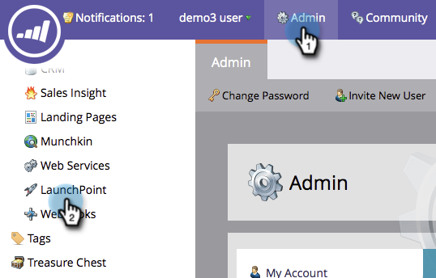

# Crear un servicio personalizado para usar con la API de ReST {#create-a-custom-service-for-use-with-rest-api}

Si desea integrarse con Marketo a través de la API de ReST, debe crear un servicio personalizado. Así es como.

>[!PREREQUISITES]
>
>* [Crear una función de usuario solo de API](/help/marketo/product-docs/administration/users-and-roles/create-an-api-only-user-role.md)
>* [Crear un usuario solo de API](/help/marketo/product-docs/administration/users-and-roles/create-an-api-only-user.md)

>

>[!NOTE]
>
>**Se requieren permisos de administrador**

>[!TIP]
>
>Consulte la documentación de nuestros desarrolladores para obtener más información sobre la [API de ReST](https://developers.marketo.com/documentation/rest/). También tenemos la [API SOAP](https://developers.marketo.com/documentation/soap/) si es lo que necesita.

>[!NOTE]
>
>No puede crear un servicio personalizado si tiene el nivel Spark de Marketo.

## Crear servicio personalizado {#create-custom-service}

1. Vaya a **Admin** y haga clic en **LaunchPoint**.

   

1. En **Nuevo**, haga clic en **Nuevo servicio**.

   

1. Introduzca un **Display Name** para el servicio. Seleccione **API Only User** [creado anteriormente](/help/marketo/product-docs/administration/users-and-roles/create-an-api-only-user.md).

   >[!NOTE]
   >
   >Tenga en cuenta que ya tenemos integración nativa para los servicios de seminarios web más populares.

   

1. Haga clic en **Crear**.

   

   ¡Oh sí! El servicio se ha creado, sigamos adelante y obtengamos todas las credenciales para proporcionar acceso.

## Credenciales de acceso a API {#credentials-for-api-access}

1. Vaya a **Admin** y haga clic en **LaunchPoint**.

   

1. Haga clic en **Ver detalles** para el servicio personalizado de LaunchPoint creado anteriormente.

   

1. Haga clic en **Obtener token**.

   

1. Proporcione el **Client Id**, **Client Secret**, **Authorized User** y el **Token** a la persona responsable del establecimiento de la conexión.

   

>[!CAUTION]
>
>No comparta esta información; es la puerta trasera de sus datos. ¡Mantenlo a salvo!
