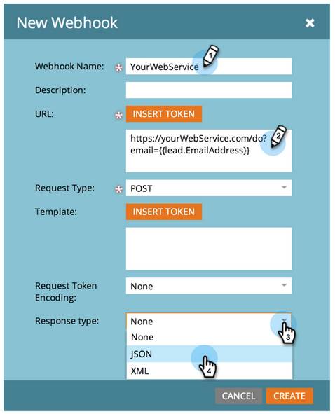
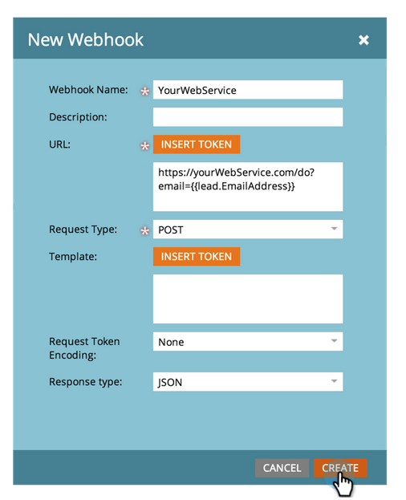

# Crear un(a) [!DNL Webhook] {#create-a-webhook}

Use [!DNL Webhooks] para aprovechar los servicios web de terceros y enviar mensajes de texto, expandir datos personales y mucho más.

1. Vaya al área de **[!UICONTROL Admin]**.

   

1. Haga clic en **[!UICONTROL Webhooks]**.

   

1. Haga clic en **[!UICONTROL Nuevo webhook]**.

   

1. Asigne un nombre a su [!DNL Webhook] y configúrelo.

   

   >[!NOTE]
   >
   >Esto suele incluir la introducción de las credenciales de servicio de terceros como parámetro de URL o en la plantilla POST.

   * **[!UICONTROL URL]**: Escriba la URL que use en su solicitud al servicio web. Para insertar un token, como la dirección de correo electrónico de la persona (**`{{lead.Email Address}}`**), en su solicitud, haga clic en **[!UICONTROL Insertar token]**.

   * **[!UICONTROL Plantilla]**: Si desea transmitir información en el cuerpo de la solicitud, ingrese a través de la plantilla de carga útil. Plantillas permitidas para los siguientes tipos de solicitud: POST, DELETE, PATCH o PUT. Puede utilizar formatos de datos como JSON o XML. Para insertar un token en su plantilla, haga clic en **[!UICONTROL Insertar token]**.

   * **[!UICONTROL Codificación de token de solicitud]**: Si los valores de token incluyen caracteres especiales (como un signo &amp;), indique el formato de su solicitud (**JSON** o **Formulario/URL**).

   * **[!UICONTROL Tipo de respuesta]**: seleccione el formato de la respuesta que recibe del servicio (**JSON** o **XML**).

   * **[!UICONTROL Tipo de solicitud]**: seleccione el método HTTP que desea utilizar (DELETE, GET, PATCH, POST, PUT).

1. Haga clic en **[!UICONTROL Crear]**.

   

>[!NOTE]
>
>Obtenga más información en la profundización de [[!DNL Webhooks]](https://experienceleague.adobe.com/en/docs/marketo-developer/marketo/webhooks/webhooks){target="_blank"}.
