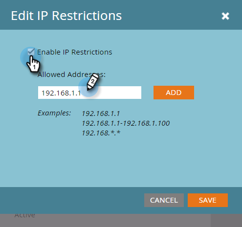
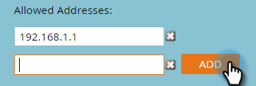

# Creación de una Lista de permitidos para el acceso a API basado en IP {#create-an-allowlist-for-ip-based-api-access}

A veces, desea conceder acceso a la API solo a una dirección IP específica o a un intervalo de direcciones. Para ello, primero debe habilitar las restricciones y luego especificar las direcciones IP permitidas para utilizar las API.

>[!NOTE]
>
>**Se requieren permisos de administrador**

>[!NOTE]
>
>Esta característica funciona independientemente de las [restricciones de inicio de sesión basadas en IP](https://experienceleague.adobe.com/es/docs/marketo/using/product-docs/administration/settings/restrict-marketo-logins-based-on-ip){target="_blank"} de Marketo Engage que se están reemplazando con el [control de acceso basado en IP](https://helpx.adobe.com/es/enterprise/using/ip-based-access.html){target="_blank"} de Admin Console. Continuará funcionando tal cual después de la migración de Adobe IMS.

1. Vaya al área de **[!UICONTROL Admin]**.

   

1. Haga clic en **[!UICONTROL Servicios web]**.

   

1. En el área **[!UICONTROL Restricciones de IP]**, haga clic en **[!UICONTROL Editar],** o en **[!UICONTROL Editar restricciones de IP]** en la esquina superior izquierda.

   

1. Marque la casilla **[!UICONTROL Habilitar restricciones de IP]** e introduzca las direcciones IP que desea Lista de permitidos.

   

   >[!NOTE]
   >
   >Puede introducir una sola dirección IP o un intervalo de ellas, o utilizar un comodín.

1. Haga clic en **[!UICONTROL Agregar]** para abrir campos adicionales e introducir más direcciones IP.

   

1. Haga clic en **[!UICONTROL Guardar]**.

   
