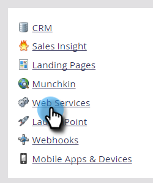

# Crear una Lista de permitidos para el acceso a la API basada en IP {#create-an-allowlist-for-ip-based-api-access}

A veces, solo desea conceder acceso a la API a una dirección IP específica o a un rango de direcciones. Para ello, primero debe activar las restricciones y, a continuación, especificar las direcciones IP permitidas para utilizar las API.

>[!NOTE]
>
>**Se requieren permisos de administrador**

1. Vaya a la **Administrador** .

   

1. Haga clic en **Servicios Web**.

   

1. En el área Restricciones de IP, haga clic en **Editar,** o haga clic en **Editar restricciones de IP** en la parte superior izquierda.

   

1. Marque la **Habilitar restricciones de IP** e introduzca las direcciones IP que desea lista de permitidos.

   

   >[!NOTE]
   >
   >Puede introducir una sola dirección IP o un rango de ellas, o utilizar un comodín.

1. Haga clic en **Agregar** para abrir campos adicionales e introducir más direcciones IP.

   

1. Haga clic en **Guardar**.

   
