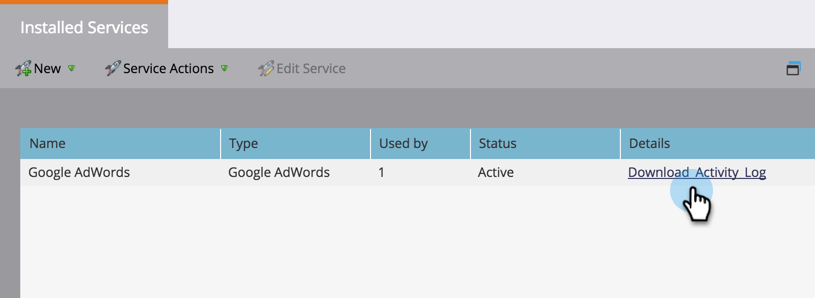

# Descargar el registro de actividades de GoogleAdwords {#download-googleadwords-activity-log}

Sucede lo que pasa. A veces, debe descargar el registro de actividades para solucionar problemas.

1. Vaya a **Admin** y haga clic en **LaunchPoint**.

   

1. Busque su servicio de Google AdWords y haga clic en **Descargar registro de actividades**.

   

1. Se descargará un archivo .zip en su equipo.
