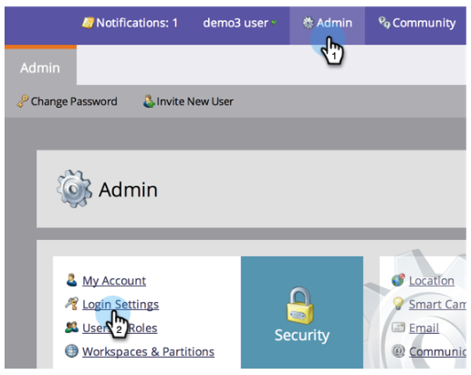

# Restringir el inicio de sesión del usuario solo a SSO {#restrict-user-login-to-sso-only}

Si [uso de SSO](/help/marketo/product-docs/administration/additional-integrations/add-single-sign-on-to-a-portal.md) y desea garantizar que los usuarios no puedan evitar la seguridad de SSO, siga estas instrucciones.

>[!IMPORTANT]
>
>Este artículo no se aplica a [Habilitado para Adobe IMS](/help/marketo/product-docs/administration/marketo-with-adobe-identity/adobe-identity-management-overview.md) Suscripciones a Marketo.

>[!NOTE]
>
>**Se requieren permisos de administrador**

1. Vaya a **Administrador** y haga clic en **Configuración de inicio de sesión**.

   

1. Haga clic en **Editar configuración de seguridad**.

   

1. Expanda la Configuración avanzada, marque **Requerir SSO** y haga clic en **Guardar**.

>[!NOTE]
>
>Una práctica recomendada es invitar a los usuarios y aceptar la invitación. _Después_ Cuando se acepta la invitación, los administradores deben configurarlos como &quot;Requerir SSO&quot;.

>[!TIP]
>
>Si selecciona **Requerir SSO**, puede excluir un [función de usuario](/help/marketo/product-docs/administration/users-and-roles/create-delete-edit-and-change-a-user-role.md) de esta restricción comprobando el **Omitir el inicio de sesión único** al configurar la función. Esto permitirá a los usuarios iniciar sesión con normalidad. Por ejemplo, es posible que los usuarios administradores tengan que iniciar sesión en Marketo a través de la pantalla de inicio de sesión.

>[!CAUTION]
>
>Cuando se invita a nuevos usuarios, reciben correos electrónicos de invitación. Sin embargo, si **Requerir SSO** está seleccionada, no recibirán estos correos electrónicos, a menos que se les asigne una función configurada como **Omitir el inicio de sesión único**.

¡Eso es todo! Ahora todos los usuarios (excepto los usuarios con permiso para evitar el inicio de sesión único) estarán restringidos a usar solo el inicio de sesión SSO.

>[!MORELIKETHIS]
>
>* [Agregar el inicio de sesión único a un portal](/help/marketo/product-docs/administration/additional-integrations/add-single-sign-on-to-a-portal.md)
>* [Uso de un ID universal para el inicio de sesión de suscripción](/help/marketo/product-docs/administration/settings/using-a-universal-id-for-subscription-login.md)
>* [Invitación de usuarios de Marketo a dos instancias con ID universal](https://nation.marketo.com/t5/Knowledgebase/Inviting-Marketo-Users-to-Two-Instances-with-Universal-ID-UID/ta-p/251122)

