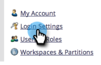

# Restringir el inicio de sesión del usuario a solo SSO {#restrict-user-login-to-sso-only}

Si usted es [uso de SSO](/help/marketo/product-docs/administration/additional-integrations/add-single-sign-on-to-a-portal.md) y desea asegurarse de que los usuarios no puedan omitir la seguridad de SSO, siga estas instrucciones.

>[!IMPORTANT]
>
>Este artículo no se aplica a [Habilitado para IMS de Adobe](/help/marketo/product-docs/administration/marketo-with-adobe-identity/adobe-identity-management-overview.md) Suscripciones de Marketo.

>[!NOTE]
>
>**Permisos de administración necesarios**

1. Vaya a la **[!UICONTROL Administrador]** área.

   

1. Clic **[!UICONTROL Configuración de inicio de sesión]s**.

   

1. Clic **[!UICONTROL Editar configuración de seguridad]**.

   

1. Expanda el **[!UICONTROL Avanzadas]** configuración, comprobar **[!UICONTROL Requerir SSO]** y haga clic en **[!UICONTROL Guardar]**.

>[!NOTE]
>
>Una práctica recomendada es que se invite a los usuarios y que acepten la invitación. _Después_ Si se acepta la invitación, los administradores deben establecerla en &quot;[!UICONTROL Requerir SSO].&quot;

>[!TIP]
>
>Si selecciona **[!UICONTROL Requerir SSO]**, puede excluir un [función de usuario](/help/marketo/product-docs/administration/users-and-roles/create-delete-edit-and-change-a-user-role.md) de esta restricción comprobando la **[!UICONTROL Omitir el inicio de sesión único]** al configurar la función. Esto permitirá a los usuarios iniciar sesión normalmente. Por ejemplo, es posible que los usuarios administradores tengan que iniciar sesión en Marketo a través de la pantalla de inicio de sesión.

>[!CAUTION]
>
>Cuando se invita a nuevos usuarios, reciben correos electrónicos de invitación. Sin embargo, si **[!UICONTROL Requerir SSO]** está seleccionado, no recibirán estos mensajes de correo electrónico, a menos que se les asigne una función configurada como **[!UICONTROL Omitir el inicio de sesión único]**.

¡Eso es todo! Ahora todos los usuarios (excepto los usuarios con permiso para omitir el inicio de sesión único) estarán restringidos a utilizar solo el inicio de sesión SSO.

>[!MORELIKETHIS]
>
>* [Agregar el inicio de sesión único a un portal](/help/marketo/product-docs/administration/additional-integrations/add-single-sign-on-to-a-portal.md)
>* [Uso de un ID universal para el inicio de sesión con suscripción](/help/marketo/product-docs/administration/settings/using-a-universal-id-for-subscription-login.md)
>* [Invitación de usuarios de Marketo a dos instancias con ID universal](https://nation.marketo.com/t5/Knowledgebase/Inviting-Marketo-Users-to-Two-Instances-with-Universal-ID-UID/ta-p/251122)

