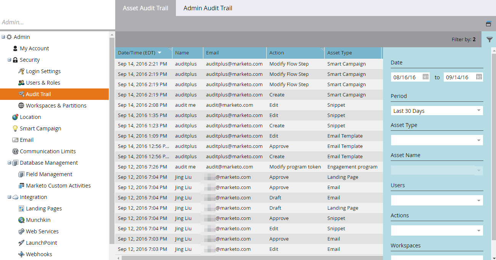

# Información general de pista de auditoría {#audit-trail-overview}

La pista de auditoría le permite obtener un historial completo (seis meses) de los cambios realizados en la instancia de Marketo.

>[!NOTE]
>
>El historial de datos de pistas de auditoría comenzó el 14 de septiembre de 2016.

## ¿Qué es la pista de auditoría? {#what-is-audit-trail}

La pista de auditoría captura, en tiempo real, una lista completa de las acciones y eventos que se producen dentro de una suscripción a Marketo. Incluye una forma de autoservicio de acceder a un historial de datos de seis meses para responder preguntas como:

¿Qué ha pasado con este recurso o esta configuración y quién la actualizó por última vez?

¿Qué ha estado haciendo el usuario X?

¿Quién está iniciando sesión en nuestra cuenta?

## Qué auditamos {#what-we-audit}

Marketo auditará el [crear, editar y eliminar](/help/marketo/product-docs/administration/audit-trail/change-details-in-audit-trail.md) acciones para:

* Diseñar recursos de estudio
* Todos los programas de Marketo
* Campañas inteligentes
* Listas (inteligentes/estáticas)
* Usuarios (administrador)
* Roles y permisos (administrador)
* Espacio de trabajo y particiones (administrador)
* Historial de inicio de sesión del usuario

>[!NOTE]
>
>Marketo es _not_ auditar los cambios realizados en Personalización web, Contenido predictivo o Perspectiva de ventas en este momento.

## Componentes de pista de auditoría {#audit-trail-components}

La pista de auditoría consta de tres componentes.

**1) [Pista de auditoría de recursos](/help/marketo/product-docs/administration/audit-trail/change-details-in-audit-trail.md#asset-audit-trail)**

Consulte la actividad realizada en recursos específicos.

**2) [Pista de auditoría del administrador](/help/marketo/product-docs/administration/audit-trail/change-details-in-audit-trail.md#admin-audit-trail)**

Monitorice los detalles basados en el usuario.

**3) [Historial de inicio de sesión del usuario](/help/marketo/product-docs/administration/audit-trail/user-login-history.md)**

Vea quién ha estado iniciando sesión en su suscripción y cuándo. También incluye los intentos de inicio de sesión fallidos.

>[!TIP]
>
>Hay tanto que puede auditar usando la pista de auditoría, asegúrese de utilizar [Filtrado](/help/marketo/product-docs/administration/audit-trail/filtering-in-audit-trail.md)!

## Exportación de datos {#exporting-data}

Solo puede ver los datos correspondientes a 30 días en su instancia. Para obtener un valor máximo de seis meses, utilice la opción de exportación.

>[!NOTE]
>
>**Definición**
>
>**Desconocido:** En la pista de auditoría, es posible que vea el nombre y el correo electrónico de un usuario como &quot;Desconocido&quot;. Esto ocurre cuando realiza un cambio en los valores de la lista de selección en su CRM. Estos valores aparecen en los formularios de Marketo y en las páginas de aterrizaje. Al realizar esta actualización en CRM, se borrarán automáticamente las páginas de aterrizaje que hagan referencia al formulario. En la pista de auditoría, se capturará que la página de aterrizaje se ha redactado, pero el nombre y el correo electrónico del usuario se mostrarán como &quot;Desconocido&quot;, ya que no se puede capturar la información del usuario desde el lado de CRM.

>[!MORELIKETHIS]
>
>[Habilitar pista de auditoría](/help/marketo/product-docs/administration/audit-trail/enable-audit-trail.md)
