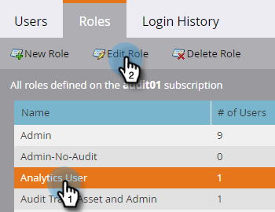

# Habilitar pista de auditoría {#enable-audit-trail}

La pista de auditoría está disponible para todos los clientes y está controlada por dos permisos de administrador.

>[!NOTE]
>
>De forma predeterminada, todos los roles de administrador del sistema tienen ambos permisos habilitados.

## Habilitar pista de auditoría para una función {#enable-audit-trail-for-a-role}

1. Haga clic en **Admin**.

   

1. Seleccione **Users &amp; Roles** y haga clic en **Roles**.

   

1. Seleccione la función para la que desea habilitar la pista de auditoría y haga clic en **Editar función**.

   

   >[!NOTE]
   >
   >También tiene la opción aquí para crear una nueva función y otorgarle acceso a Pista de auditoría.

1. Expanda el permiso **Access Admin**. Seleccione **Access Audit Track** o **Access Login History**, según sus necesidades. Haga clic en **Guardar**.

   

   >[!NOTE]
   >
   >**Definición**
   >
   >**Acceso a pista de auditoría:** otorga a los usuarios acceso a la pista de auditoría de recursos y a la pista de auditoría de administración.
   >
   >**Acceso al historial de inicio de sesión:** otorga a los usuarios acceso al historial de inicio de sesión del  [usuario](/help/marketo/product-docs/administration/audit-trail/user-login-history.md).

## Asignar función de pista de auditoría a un usuario {#assign-audit-trail-role-to-a-user}

>[!PREREQUISITES]
>
> Cree o   habilite una función existente, otorgándole permisos de pista de auditoría.

1. En **Usuarios y funciones**, haga clic en **Usuarios**.

   

1. Seleccione el usuario al que desea conceder acceso a la pista de auditoría y haga clic en **Editar usuario**.

   

   >[!NOTE]
   >
   >Este proceso también se aplica cuando se crea un nuevo usuario.

1. Seleccione las funciones de pista de auditoría que ha creado. En este ejemplo creamos &quot;Pista de auditoría - Activo y administrador&quot; y &quot;Pista de auditoría - Con historial de inicio de sesión&quot;.

   

   >[!CAUTION]
   >
   >Si tiene espacios de trabajo habilitados, asegúrese de marcar la casilla de verificación de la función, que selecciona todos los espacios de trabajo. Al anular la selección de un espacio de trabajo individual, se ocultará la pista de auditoría. Esto significa que verá los datos de pista de auditoría de cada espacio de trabajo. Tiene la opción de ocultar espacios de trabajo al [filtrar](/help/marketo/product-docs/administration/audit-trail/filtering-in-audit-trail.md).

1. Haga clic en **Guardar**.

   
