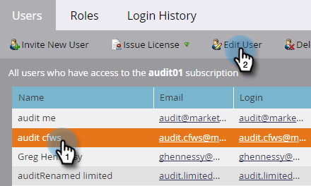

# Habilitar seguimiento de auditoría {#enable-audit-trail}

La pista de auditoría está disponible para todos los clientes y controlada por dos permisos de administrador.

>[!NOTE]
>
>De forma predeterminada, todas las funciones de administrador del sistema tienen ambos permisos habilitados.

## Habilitar pista de auditoría para un rol {#enable-audit-trail-for-a-role}

1. Haga clic en **[!UICONTROL Administrador]**.

   

1. Seleccione **[!UICONTROL Usuarios y roles]** y haga clic en **[!UICONTROL Roles]**.

   

1. Seleccione la función para la que desea habilitar la pista de auditoría y haga clic en **[!UICONTROL Editar función]**.

   

   >[!NOTE]
   >
   >También tiene la opción de crear una función nueva y otorgarle acceso a Pista de auditoría.

1. Expanda el permiso **[!UICONTROL Administrador de acceso]**. Seleccione **[!UICONTROL Registro de auditoría de acceso]** y/o **[!UICONTROL Historial de inicio de sesión de acceso]**, según sus necesidades. Haga clic en **[!UICONTROL Guardar]**.

   

   >[!NOTE]
   >
   >**Definición**
   >
   >**[!UICONTROL Pista de auditoría de acceso]**: otorga a los usuarios acceso a [!UICONTROL Pista de auditoría de recursos] y a [!UICONTROL Pista de auditoría de administración].
   >
   >**[!UICONTROL Historial de inicio de sesión con acceso]**: otorga a los usuarios acceso a [Historial de inicio de sesión de usuario](/help/marketo/product-docs/administration/audit-trail/user-login-history.md).

## Asignar la función de pista de auditoría a un usuario {#assign-audit-trail-role-to-a-user}

>[!PREREQUISITES]
>
>[Crear](/help/marketo/product-docs/administration/users-and-roles/create-delete-edit-and-change-a-user-role.md#create-a-role) o [habilitar](#enable-audit-trail) un rol existente, dándole permisos de pista de auditoría.

1. En **[!UICONTROL Usuarios y funciones]**, haga clic en **[!UICONTROL Usuarios]**.

   

1. Seleccione el usuario al que desea otorgar acceso a la pista de auditoría y haga clic en **[!UICONTROL Editar usuario]**.

   

   >[!NOTE]
   >
   >Este proceso también se aplica cuando crea un nuevo usuario.

1. Seleccione las funciones de pista de auditoría que ha creado. En este ejemplo creamos &quot;Pista de auditoría: recurso y administración&quot; y &quot;Pista de auditoría: con historial de inicio de sesión&quot;.

   

   >[!CAUTION]
   >
   >Si tiene espacios de trabajo activados, asegúrese de marcar la casilla de verificación de la función, que selecciona todos los espacios de trabajo. Al anular la selección de un espacio de trabajo individual, se oculta la pista de auditoría. Esto significa que verá datos de pista de auditoría para cada espacio de trabajo. Tiene la opción de ocultar espacios de trabajo al [filtrar](/help/marketo/product-docs/administration/audit-trail/filtering-in-audit-trail.md).

1. Haga clic en **[!UICONTROL Guardar]**.

   
