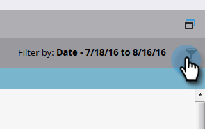

# Filtrado en seguimiento de auditoría {#filtering-in-audit-trail}

Filtre por lapso de tiempo, tipo de recurso, usuarios, acciones realizadas y mucho más.

1. Haga clic en **[!UICONTROL Administrador]**.

   

1. En **[!UICONTROL Seguridad]**, seleccione **[!UICONTROL Pista de auditoría]**.

   

1. Haga clic en el icono de filtro.

   

   >[!NOTE]
   >
   >Hay una multitud de combinaciones de parámetros de búsqueda posibles. Este ejemplo localiza: _todos los mensajes de correo electrónico - editados por cualquier persona - en los siete días anteriores_.

1. Haga clic en el menú desplegable **[!UICONTROL Periodo]** y seleccione **[!UICONTROL Últimos 7 días]**.

   

1. Haga clic en el menú desplegable **[!UICONTROL Tipo de recurso]** y seleccione **[!UICONTROL Correo electrónico]**.

   

1. Haga clic en la lista desplegable **[!UICONTROL Acciones]** y seleccione **[!UICONTROL Editar]**.

   

1. Haga clic en **[!UICONTROL Aplicar]**.

   

1. Los resultados filtrados aparecen a la izquierda.

   

   >[!NOTE]
   >
   >Si tiene espacios de trabajo habilitados, verá datos de auditoría para todos los espacios de trabajo. Si aplica un filtro de área de trabajo, Marketo recuerda el valor del área de trabajo anterior cada vez que utiliza la pista de auditoría. Se aplican permisos de Workspace en el nivel de recurso.

   >[!MORELIKETHIS]
   >
   >[Cambiar detalles en la pista de auditoría](/help/marketo/product-docs/administration/audit-trail/change-details-in-audit-trail.md)
