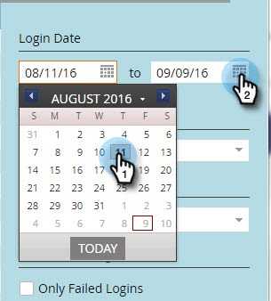

# Historial de inicio de sesión del usuario {#user-login-history}

El historial de inicio de sesión del usuario ayuda a mantener la responsabilidad y la seguridad al mostrar exactamente quién ha iniciado sesión en su suscripción, incluidos los intentos de inicio de sesión fallidos.

>[!PREREQUISITES]
>
>Debe tener una función con el permiso Acceso al historial de inicio de sesión habilitado para ver el historial de inicio de sesión del usuario.

El historial de inicio de sesión del usuario identifica a las personas que inician sesión mediante:

* Fecha y hora de inicio de sesión
* Nombre y dirección de correo electrónico del usuario
* Rol
* Espacio de trabajo
* Dirección IP

Para ver el historial de inicio de sesión del usuario:

1. Vaya a la **Administrador** .

   

1. En Seguridad, haga clic en **Usuarios y funciones**.

   

1. Haga clic en el **Historial de inicio de sesión** pestaña . La lista muestra los inicios de sesión más recientes.

   

1. Utilice el filtro para limitar la búsqueda.

   

1. Seleccione un intervalo de fechas utilizando los selectores de fechas.

   

1. O bien, elija en la lista desplegable .

   

1. Seleccione los usuarios en el **Usuarios** lista desplegable.

   

1. Marque la **Solo los inicios de sesión con errores** para mostrar solo los inicios de sesión fallidos en la búsqueda.

   

1. Haga clic en **Aplicar**.

   

   >[!NOTE]
   >
   >La interfaz de usuario muestra datos de hasta 30 días. Si necesita más información, puede descargar los últimos seis meses de datos en un archivo csv.

   >[!NOTE]
   >
   >[Información general de pista de auditoría](/help/marketo/product-docs/administration/audit-trail/audit-trail-overview.md)
