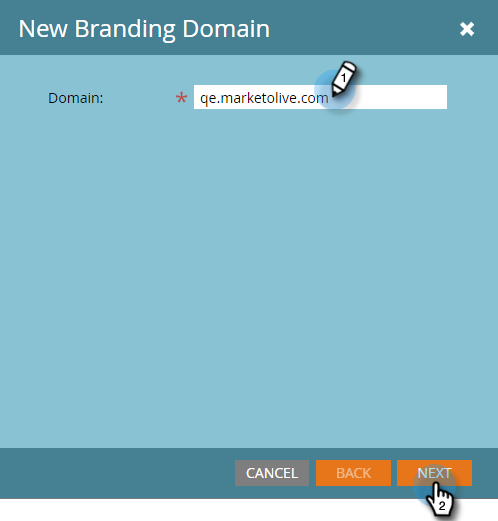

# Añadir un dominio de personalización de marca adicional con espacios de trabajo {#add-an-additional-branding-domain-with-workspaces}

Si tiene espacios de trabajo, puede agregar dominios de promoción de la marca adicionales.

>[!PREREQUISITES]
>
>* [Edite su dominio de personalización de marca predeterminado](/help/marketo/product-docs/administration/email-setup/add-multiple-branding-domains/edit-your-default-branding-domain.md).
>
>* [Reemplace el vínculo de seguimiento genérico](/help/marketo/product-docs/administration/email-setup/add-multiple-branding-domains/edit-your-default-branding-domain-with-workspaces.md) por un dominio de personalización de marca antes de agregar dominios de personalización de marca adicionales.

1. Vaya al área de **[!UICONTROL Admin]**.

   

1. Haga clic en **[!UICONTROL Correo electrónico]**.

   

1. Haga clic en **[!UICONTROL Agregar]** para agregar un dominio de marca adicional.

   

1. Introduzca un nuevo dominio de personalización de marca. Haga clic en **[!UICONTROL Next]**.

   

   >[!NOTE]
   >
   >Puede elegir convertir este dominio en principal para uno o más espacios de trabajo, y todos los correos electrónicos no enviados existentes que estén configurados en &quot;Predeterminado&quot; y todos los correos electrónicos recién creados se establecerán de forma predeterminada en el dominio principal. Puede anular esto por correo electrónico.

1. Seleccione el nuevo dominio de personalización de marca y haga clic en **[!UICONTROL Guardar]**.

   
