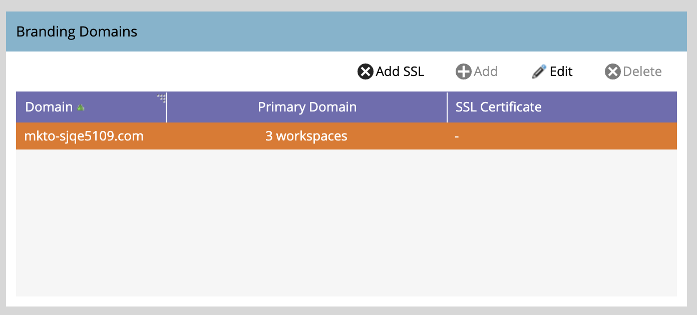

# Añadir un dominio de personalización de marca adicional {#add-an-additional-branding-domain}

Agregue un dominio de promoción de la marca adicional cuando ejecute varias marcas desde una sola instancia de Marketo y desee que cada una tenga sus propios vínculos de seguimiento de marca.

>[!PREREQUISITES]
>
>Debe [reemplazar el vínculo de seguimiento genérico](/help/marketo/product-docs/administration/email-setup/add-multiple-branding-domains/edit-your-default-branding-domain.md){target="_blank"} por un dominio con marca antes de agregar dominios con marca adicionales.

1. Vaya al área de **[!UICONTROL Admin]**.

   

1. Haga clic en **[!UICONTROL Correo electrónico]**.

   

1. Haga clic en **[!UICONTROL Agregar]** para agregar un dominio de marca adicional.

   {width="600"}

1. Escriba el nombre del nuevo dominio de promoción de la marca, seleccione _Convertir en dominio principal_ o _Generar certificado SSL_ (ambos opcionales) y haga clic en **[!UICONTROL Guardar]**.

   

>[!NOTE]
>
>* _Convertir en dominio principal_: conviértalo en su dominio principal, y todos los correos electrónicos existentes no enviados que estén configurados en &quot;Predeterminado&quot; y todos los correos electrónicos recién creados se establecerán de forma predeterminada en el dominio principal. Puede [sobrescribir esto por correo electrónico](/help/marketo/product-docs/administration/email-setup/add-multiple-branding-domains/overwrite-primary-domain-for-emails.md){target="_blank"}.
>
>* _Generar certificado SSL_: puede crear una capa de sockets seguros (SSL) con la creación del dominio. El primer dominio de seguimiento iniciará una configuración única de la infraestructura que puede tardar unas horas. Se le notificará una vez finalizado y podrá configurar el primer dominio. Para agregar SSL a los dominios existentes, comuníquese con [Soporte técnico de Marketo](https://nation.marketo.com/t5/support/ct-p/Support){target="_blank"}.

## Editar SSL para dominios existentes

Siga estos pasos para habilitar SSL para los dominios existentes.

1. En el área _[!UICONTROL Administrador]_, seleccione **[!UICONTROL Correo electrónico]**.

1. En la ficha _[!UICONTROL Dominio]_, seleccione la fila de dominio y haga clic en **[!UICONTROL Agregar SSL]**.

   {width="600"}

1. En el cuadro de diálogo, haga clic en **[!UICONTROL Confirmar]**.

   {width="400"}

## Mensajes de error {#error-messages}

<table><thead>
  <tr>
    <th>Error</th>
    <th>Detalles</th>
  </tr></thead>
<tbody>
<tr>
    <td><i>El dominio ya existe.</i></td>
    <td>Ya existe un dominio con el mismo nombre.</td>
  </tr>
  <tr>
    <td><i>El dominio no está asignado al dominio predeterminado.</i></td>
    <td>El dominio personalizado no está asignado correctamente al dominio predeterminado. Compruebe la configuración de asignación de dominios y asegúrese de que la configuración de DNS apunta al dominio predeterminado correcto.</td>
  </tr>
  <tr>
    <td><i>No se pudieron emitir certificados SSL debido a registros CAA no admitidos. Solicite a su departamento de TI que actualice sus registros de CAA.</i></td>
    <td>Los registros de CAA no están actualizados. Para los que utilizan certificados SSL administrados por Marketo Engage, los registros CAA deben actualizarse a los certificados recomendados por el proveedor de Marketo. Póngase en contacto con su departamento de TI para actualizar los registros de CAA. Consulte <a href="https://nation.marketo.com/t5/product-blogs/changes-to-marketo-engage-secured-domains-platform/ba-p/329305#M2246">esta página</a> para obtener más información.</td>
  </tr>
  <tr>
    <td><i>Ya se ha emitido el certificado SSL.</i></td>
    <td>Ya existe un certificado SSL para este dominio personalizado. No es necesario realizar ninguna otra acción a menos que el certificado haya caducado o sea necesario volver a emitirlo.</td>
  </tr>
  <tr>
    <td><i>No se ha encontrado el dominio predeterminado. Póngase en contacto con Soporte para obtener ayuda.</i></td>
    <td>Se ha producido un problema al intentar localizar el dominio predeterminado. Póngase en contacto con Asistencia para realizar investigaciones.</td>
  </tr>
  <tr>
    <td><i>Error inesperado al crear un dominio. Póngase en contacto con Soporte para obtener ayuda.</i></td>
    <td>Se ha producido un error inesperado. Recopile registros y detalles del error y escale el problema a <a href="https://nation.marketo.com/t5/support/ct-p/Support" target="_blank">Soporte técnico de Marketo</a>.</td>
  </tr>
</tbody></table>

## Cosas que hay que tener en cuenta {#things-to-note}

* **Asignación de DNS para dominio en Marketo Engage**: antes de agregar dominios en la interfaz de usuario, debe [asignar CNAME a un dominio proporcionado por Marketo](https://experienceleague.adobe.com/es/docs/marketo/using/getting-started/initial-setup/setup-steps#customize-your-landing-page-urls-with-a-cname){target="_blank"}.

* **SSL personalizados**: Si necesita un SSL personalizado, envíe un [ticket de asistencia](https://nation.marketo.com/t5/support/ct-p/Support){target="_blank"}. No utilice la casilla de verificación de autoservicio para la creación SSL.

* **SSL preexistentes**: Al agregar un dominio, el sistema comprueba los SSL preexistentes, que pueden haberse creado manualmente anteriormente. Si encuentra esta validación, cree su dominio sin seleccionar la creación de SSL y póngase en contacto con el [soporte técnico](https://nation.marketo.com/t5/support/ct-p/Support){target="_blank"} para que se conecten.

* **Eliminación de dominios**: Al eliminar automáticamente un dominio **no** se elimina el certificado SSL. Esta protección evita los errores de usuario que hacen que un sitio web no tenga certificados SSL. Si desea quitar los certificados SSL, [póngase en contacto con el soporte técnico](https://nation.marketo.com/t5/support/ct-p/Support){target="_blank"}.

* Si el dominio que agrega aparece como cualquier otro que no sea CNAME, se bloqueará la capacidad de agregar más dominios de seguimiento con marca. Deberá editar cualquier dominio existente y asegurarse de que sea un registro CNAME y no, por ejemplo, un registro A. El botón Añadir comprueba dinámicamente solo los CNAME.

>[!MORELIKETHIS]
>
>[Editar su dominio de marca predeterminado](/help/marketo/product-docs/administration/email-setup/add-multiple-branding-domains/edit-your-default-branding-domain.md){target="_blank"}
